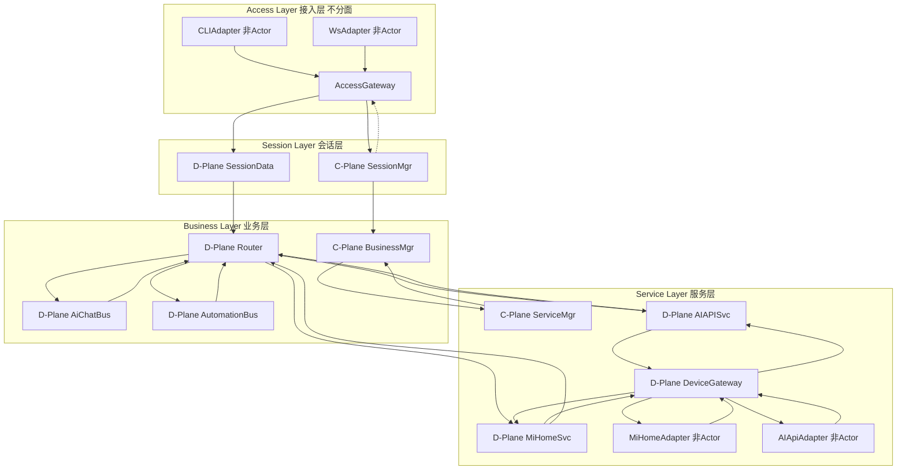
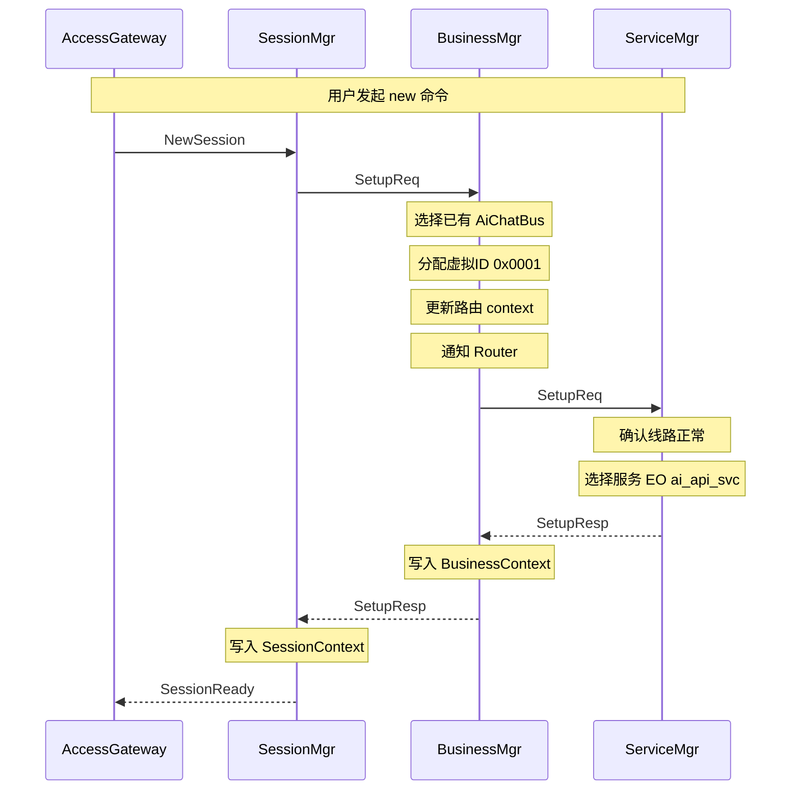
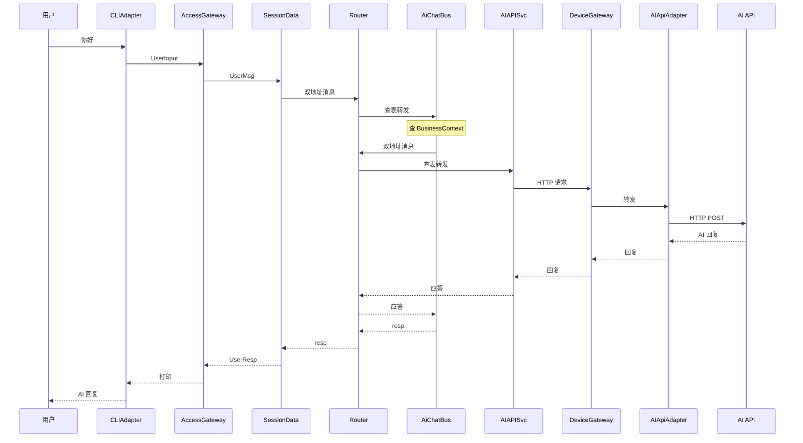
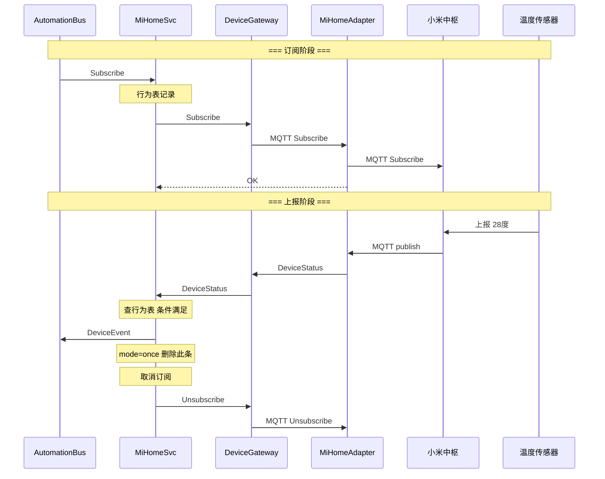

# Flow Hub

> 一个基于 Actor 模型的消息驱动嵌入式编排平台  
> 版本：v0.1  |  最后更新：2026-05-24

---

## 1. 项目定位

Flow Hub 是一个基于 Actor 模型的消息驱动嵌入式编排平台。它通过统一的消息抽象和无状态的计算单元（EO）将任意外部资源——AI API、智能家居设备、工业总线、视觉处理单元等——纳入统一的消息路由和规则引擎下进行编排。

系统不预设应用场景。智能家居、工业控制、边缘 AI 编排、多协议桥接均为其可能的应用方向。

**核心特征**：
- 全异步消息驱动，无共享状态，天然无锁
- 无状态计算单元 + 外部上下文，支持热备切换和独立单元测试
- 静态内存池，禁止运行时堆分配，内存行为完全可预测
- 设计上预留框架抽象层，未来可切换底层运行时（待实现）

---

## 2. 适用硬件

| 部署 Profile | 目标平台 | 运行时 |
|-------------|---------|--------|
| **Full** | Cortex-A76/A55（如 RK3588），或 x86-64 | CAF + Linux |
| **Standard** | Cortex-A72/A76（如树莓派 4/5） | CAF + Linux |
| **Minimal** | Cortex-A7/A53（如全志 H3/V3s） | CAF + Linux（裁剪编译） |
| **Real-Time** | Cortex-R（如 R5/R8）+ RTOS | 轻量级事件循环（待实现）|

系统目标平台为 Cortex-A 系列（Linux），通过预留的框架抽象层保留向 Cortex-R（RTOS）的迁移路径。Cortex-M 系列不列入——内存限制过大。

---

## 3. 核心设计理念

### 3.1 EO —— 最小业务逻辑单元

EO(Entity Object) 是本架构中最小的独立业务逻辑单元，采用 Actor 模型作为并发范式——每个 EO 是**消息驱动的、无状态的、仅通过消息与外界通信**的计算实体。

| 特性 | 说明 |
|------|------|
| **纯消息驱动** | EO 仅通过收发消息与外界交互，不暴露同步调用接口 |
| **无状态** | EO 不保存持久化业务状态，所有状态存储在外部上下文（Context）中 |
| **内部串行** | 每个 EO 内的消息处理是串行的（由底层 Actor 运行时保证），无锁安全 |
| **EO 间并行** | 不同 EO 可部署在不同 CPU 核上，运行时的 work-stealing 线程池自动调度 |
| **职责单一** | 一个 EO 只负责一类独立业务功能 |
| **故障隔离** | 单个 EO 崩溃仅影响其所属业务 |

### 3.2 上下文 —— 状态的唯一存储位置

所有业务状态存储在分层上下文中，EO 本身为零状态计算单元。

| 上下文层级 | 存储内容 | 维护者 |
|-----------|---------|--------|
| **SessionContext** | 会话 ID → 业务地址映射、会话状态 | SessionMgr |
| **BusinessContext** | 业务实例 → 服务层业务 EO 地址、运行状态、规则列表 | BusinessMgr |
| **ServiceContext** | 设备注册表 | ServiceMgr |

**原子性规则**：所有上下文修改必须与消息发送原子绑定，禁止在消息处理中间过程中修改上下文。日志/可观测性数据的写入不受此约束。

### 3.3 消息 —— 唯一的通信载体

系统中所有通信均通过消息完成。每条消息携带**双地址**：

| 字段 | 含义 | 用途 |
|------|------|------|
| **RoutineAddress** | 消息的投递目标字段，固定为 Router 的物理地址 | 所有跨层 D 面消息统一由此进入路由中转 |
| **SchedulerAddress** | 消息体第一个字段，数字标识，如 `0x0001` | 对外暴露的业务目标标识，Router 取出后查映射表解析为物理地址 |

发送方填充双地址。Router 收到后取出 SchedulerAddress 查映射表，将解析后的物理地址填入转发消息的 TargetAddress 字段。对外表现为双地址语义。

Router 内部维护映射表。多个虚拟 ID 可映射到同一物理 ID（初期），扩展多实例后不同虚拟 ID 可映射到不同物理 ID。映射表示例：

```
0x0001 → AiChatBus0 物理地址
0x0002 → AiChatBus0 物理地址  （同一物理 EO，不同虚拟 ID）
0x0003 → AiChatBus1 物理地址  （另一实例，多实例并行）
```

### 3.4 内存模型

| 特性 | 说明 |
|------|------|
| **静态内存池** | 系统预分配固定大小的消息内存池，所有消息均从池中申请 |
| **禁止运行时堆分配** | 业务路径上禁止 new / malloc，内存行为完全可预测 |
| **框架管理生命周期** | 消息的创建、传递、释放由底层框架接管，业务 EO 不感知 |
| **Fire-and-Forget 模式** | 发送方发出消息后不保留引用、不等待确认、不负责释放 |

当前采用 Fire-and-Forget 模式（发射后不管）。关于应用层消息确认重传机制的设计评估，参见架构决策记录 ADR-007。

---

## 4. 架构总览：一层接入 + 三层两面



### 各层一句话定位

| 层 | 职责 | 分面 |
|----|------|------|
| **接入层** | 怎么连进来——把外部消息翻译成内部格式 | 不分面 |
| **会话层** | 谁在说话——管会话、管消息收发 | C: 会话生命周期 / D: 数据收发 |
| **业务层** | 要干什么——所有业务逻辑在这里 | C: 资源分配 / D: 路由+业务+规则引擎 |
| **服务层** | 谁能干活——对接 AI、米家、Modbus、NPU 等 | C: 设备生命周期 / D: 业务交互+设备网关+协议适配 |

---

## 5. 各层 EO 部署

```
Access Layer（接入层 · 不分面）
├── CLIAdapter               stdin/stdout -> 内部格式（非 Actor，独立线程）
├── WsAdapter                WebSocket -> 内部格式（非 Actor，独立线程）
└── AccessGateway            分拣：控制指令 -> SessionMgr / 数据消息 -> SessionData

Session Layer（会话层）
├── C-Plane: SessionMgr      会话创建/销毁，与 BusinessMgr 交互，维护 SessionContext
└── D-Plane: SessionData     消息包装（填双地址），转发至 Router

Business Layer（业务层）
├── C-Plane: BusinessMgr     资源分配、选择业务 EO、维护路由 context 和 BusinessContext
└── D-Plane: Router          双地址解析，虚拟 ID 与物理 EO 映射，消息转发
             AiChatBus       单 AI 对话
             AiPanelBus      多 AI 讨论（裁判模式，未来）
             SceneBus        场景管理
             AutomationBus   规则引擎（跨生态设备编排核心）

Service Layer（服务层）
├── C-Plane: ServiceMgr      设备发现、连接管理、选择服务层业务 EO、维护 ServiceContext
└── D-Plane: AIAPISvc        接收业务层 AI 请求，通过 DeviceGateway 发 HTTP 给 AI 接口
             MiHomeSvc       维护行为表，条件判断，通过 DeviceGateway 控制 Adapter 订阅
             DeviceGateway   设备注册表（device_id -> Adapter），服务层内部转发
             AIApiAdapter    纯协议翻译：内部消息 <-> HTTP（非 Actor）
             MiHomeAdapter   纯协议翻译：内部消息 <-> MQTT（非 Actor）
             ModbusAdapter   Modbus RTU/TCP（预留）
             NPUAdapter      NPU 推理结果接入（预留）
```

### 服务层 D 面三层结构

```
业务层 EO（经 Router）--> 服务层业务 EO（AIAPISvc / MiHomeSvc）
                                |
                                +-- 维护行为表（MiHomeSvc）
                                +-- 条件判断
                                |
                                v
                          DeviceGateway
                                |
                                +-- 设备注册表（device_id -> Adapter）
                                |
                                v
                           Adapter（非 Actor）
                                |
                                +-- 纯协议翻译，不做过滤
                                +-- 全量上报，取消订阅前持续监听
```

---

## 6. 通信规则

### 6.1 路由规则

| 通信方向 | 规则 |
|---------|------|
| **Adapter -> AccessGateway** | 同层（接入层内部），直接通信 |
| **AccessGateway -> SessionMgr / SessionData** | 跨层（接入层->会话层），地址在启动时下发 |
| **C 面 -> C 面** | 相邻层点对点直连，不经过 Router |
| **D 面跨层** | 必须经业务层 Router 中转 |
| **同层 D 面 <-> D 面** | 直接通信，目标 EO 地址记录在对应业务的上下文中 |
| **跨层 D 面直连** | 需控制面签发通信许可证 |
| **C 面 <-> 同层 D 面** | 可直接通知 |
| **服务层 D 面内部** | 业务 EO -> DeviceGateway -> Adapter，不经过 Router |

### 6.2 Router 与双地址

跨层 D 面消息不直接发往目标 EO，而是统一经 Router 中转。这是由分层架构的核心矛盾决定的——**发送方不应该知道目标 EO 的物理地址**，因为该地址可能因扩实例、热备切换或 EO 重构而变化。

解决这一矛盾的机制由紧密配合的两个部分构成：

**Router（路由中转）**：所有跨层 D 面消息统一发送至 Router，由 Router 集中负责送达。发送方只需知道 Router 的地址（固定不变）。

**双地址**：
- **RoutineAddress**：消息的投递目标字段，固定为 Router 物理地址
- **SchedulerAddress**：消息体第一个字段，数字标识（如 `0x0001`），创建时分配，永不变化
- Router 取出 SchedulerAddress 查映射表，将解析后的物理地址填入转发消息的 RoutineAddress

两者配合的效果：物理 EO 从 1 个实例扩充到 3 个、活跃 EO 崩溃后切换到热备实例、业务 EO 重构拆分为多个子 EO——Router 更新映射表即可完成，所有依赖方代码完全无感。

### 6.3 会话建立流程（Setup）



- 全程 C 面对 C 面
- BusinessMgr **选择**已有 EO，非每次实例化
- ServiceMgr 返回服务层业务 EO 的 ID
- BusinessContext 记录 `session_eo`——业务 EO 调服务时 SchedulerAddress 填对应值

### 6.4 AI 对话消息流转



### 6.5 设备事件驱动（自动化规则）



- AutomationBus **自行决定**发起订阅，非 Setup 阶段完成
- MiHomeSvc 维护行为表（订阅者、触发条件、一次性/持续）
- MiHomeAdapter 不做任何过滤，MQTT 收到的全量上报
- 条件判断全部在 MiHomeSvc 的行为表中完成
- 一次性订阅触发后自动清理并取消 MQTT 订阅

---

## 7. 可扩展性

### 7.1 协议扩展

新增智能家居协议或工业总线，仅需在服务层新增一个 Adapter 和一个对应的服务层业务 EO（Svc），向 DeviceGateway 和 ServiceMgr 注册。业务层和会话层代码零修改。

### 7.2 跨生态编排

AutomationBus 作为规则引擎，不感知底层协议。一个规则可同时触发米家、Modbus、HomeKit 设备的动作，也可响应 NPU 视觉检测、定时器等任意事件源。规则以结构化文本（JSON）下发，支持运行中增删改。

### 7.3 Router 分阶段演进

| Phase | 版本 | 功能 |
|-------|------|------|
| **Phase 1** | 1.0 | 基础路由：虚拟 ID 与物理 EO 一一对应，EO 崩溃后原地重启 |
| **Phase 2** | 1.x | 负载监控：收集各 EO 运行时指标（纯观测） |
| **Phase 3** | 2.0 | 多实例并行：同一业务多 EO 实例并行处理，动态扩缩 |
| **Phase 4** | 2.x | 热备：活跃 EO 崩溃后虚拟 ID 瞬间重映射到热备 EO |

---

## 8. 框架抽象层（设计预留，待实现）

> **当前状态**：Demo 阶段直接使用 CAF 原生接口。框架抽象层将在核心链路跑通后实施。

设计意图：业务代码不直接依赖 CAF。通过在 CAF 之上封装一层薄抽象（`src/fw/`），将底层框架的依赖限制在 `src/fw/caf_impl/` 目录中。未来切换运行时（如 SObjectizer 或 RTOS 事件循环）只需替换该目录。

具体抽象接口将在 Demo 完成后根据实际用到的 CAF 能力进行设计。

---

## 9. 关键设计决策

| 决策 | 结论 | 理由 |
|------|------|------|
| 无状态 EO + 外部上下文 | 采用 | 热备切换无感、可独立测试、状态可审计 |
| 静态内存池 + 禁止堆分配 | 采用 | 确定性内存行为，嵌入式友好 |
| 双地址字段 | 采用 | 业务地址不变，物理部署可变 |
| D 面消息经 Router 中转 | 采用 | 消息路径可控，映射集中管理 |
| 仅业务层支持多实例 | 采用 | 会话层 I/O 密集不占 CPU，服务层瓶颈在外部设备 |
| 应用层消息确认重传 | 废弃 | Actor 崩溃不应是常态，根因应在代码质量与测试中消除 |
| 消息体持久化缓存 | 废弃 | 仅用于配合重传，重传不做则无意义 |

完整决策分析记录在 `docs/adr/` 目录下。

---

## 10. 目录结构

```
flowHub/
├── docs/
│   ├── architecture/
│   │   └── OVERVIEW.md
│   └── adr/
│
├── src/
│   ├── fw/                         <- 框架抽象层（待实现）
│   ├── utils/                      <- 工具
│   │
│   ├── access/                     <- 接入层（不分面）
│   │   ├── access_gateway.hpp / cpp
│   │   ├── cli_adapter.hpp / cpp
│   │   ├── ws_adapter.hpp / cpp    （未来）
│   │   └── CMakeLists.txt
│   │
│   ├── CPlane/                     <- 控制面
│   │   ├── session_mgr.hpp / cpp
│   │   ├── business_mgr.hpp / cpp
│   │   ├── service_mgr.hpp / cpp
│   │   └── CMakeLists.txt
│   │
│   ├── DPlane/                     <- 数据面
│   │   ├── session/
│   │   │   ├── session_data.hpp / cpp
│   │   │   └── CMakeLists.txt
│   │   │
│   │   ├── business/
│   │   │   ├── router.hpp / cpp
│   │   │   ├── ai_chat_bus.hpp / cpp
│   │   │   ├── automation_bus.hpp / cpp
│   │   │   └── CMakeLists.txt
│   │   │
│   │   └── service/
│   │       ├── ai_api_svc.hpp / cpp
│   │       ├── mi_home_svc.hpp / cpp
│   │       ├── device_gateway.hpp / cpp
│   │       ├── ai_api_adapter.hpp / cpp
│   │       ├── mi_home_adapter.hpp / cpp
│   │       └── CMakeLists.txt
│   │
│   └── main.cpp
│
├── CMakeLists.txt
├── .clang-format
├── .gitignore
├── README.md                       <- 本文件
└── LICENSE
```

---

## 11. 编码约定

| 约定 | 说明 |
|------|------|
| `.hpp` + `.cpp` 同目录 | 一个模块的所有文件集中在一个目录下 |
| `<>` 包外部库，`""` 包自己的代码 | |
| `#include` 相对 `src/` 写路径 | `#include "fw/message.hpp"` |
| 每个模块一个 `CMakeLists.txt` | 管该模块的生产代码和单元测试 |
| `ut/` 放 `_ut.cpp`，`ut/mocks/` 放 `mock_*.hpp` | 单元测试约定 |

---

## 12. 命名规范

| 角色 | 命名规则 | 示例 |
|------|---------|------|
| 控制面（C-Plane） | `功能 + Mgr` | SessionMgr, BusinessMgr, ServiceMgr |
| 会话层数据面（D-Plane） | `功能 + Data` | SessionData |
| 业务层数据面（D-Plane） | `功能 + Bus` | AiChatBus, AutomationBus, SceneBus |
| 业务层路由 | `Router` | 固定名称 |
| 服务层业务 EO（D-Plane） | `功能 + Svc` | AIAPISvc, MiHomeSvc |
| 服务层设备网关 | `DeviceGateway` | 固定名称 |
| 协议适配器 | `协议 + Adapter` | CLIAdapter, WsAdapter, MiHomeAdapter |
| 接入层网关 | `AccessGateway` | 固定名称 |

---

