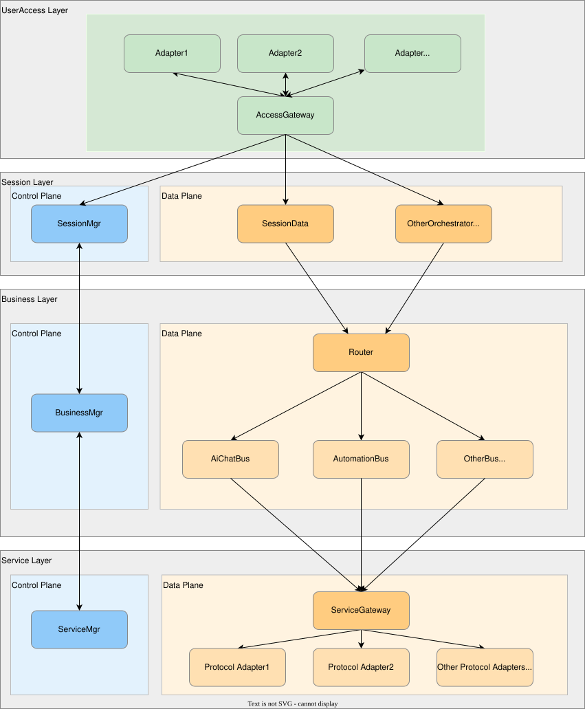

# Flow Hub

> 一个消息驱动的编排框架。协议、设备、AI——都是被调度的能力单元。

---

## 架构

四层。UserAccess 层不分面；
Session、Business、Service 层各分控制面（C）和数据面（D）。
跨层只走同面，跨面只走同层。
Business D 面以 Router 为入口，Service D 面以 ServiceGateway 为入口。

---

## 设计

### 设计起点

目标是一个**通用底座**——与具体业务无关，未来按需接入新业务，且业务类型尚未全部确定。

这意味着架构必须具备**彻底解耦**的能力：

1. 接入的协议、运行的业务、用户的前端，三者独立演进，互不影响 → **至少分服务层、业务层、接入层**
2. 中间还需要总控调度和资源管理 → **在业务层之上增加会话层**
3. 7×24 运行 → **禁止动态内存，避免碎片**

结合 5G 通信工程的成熟实践，选择了**全消息触发的 Actor 模型**。每个 Actor 自身无状态——所有状态存在静态 Context 中，执行单元与任务彻底解耦。

底层框架选用 **CAF**（C++ Actor Framework），C++ 生态中 Actor 模型最成熟的实现。

### 核心思路

通信系统中消息驱动只在大组件边界上，组件内部仍是直接调用。Flow Hub 把这一粒度推到极致——**每个业务逻辑单元（EO——Entity Object）都是独立 Actor**，互相之间全走消息，不存在直接调用。

- EO 不持有状态 → 状态全在 Context 里
- EO 崩溃换一个，Context 还在 → 天然支持热备、故障恢复
- 如果某个EO的负载过重，可以建立多个同类型EO并行处理 → 因为执行单元与业务解耦
- 层间无编译期耦合 → 新增协议只加 Adapter，新增业务只加 EO，已有代码不动
- 裁剪方便 → 部署到低算力硬件，砍掉不需要的 EO 即可
- 所有EO全部在整个系统启动时构造完毕，除特殊情况下不会动态建立和销毁EO。

### 四层架构

| 层 | 角色 | C 面（控制） | D 面（数据） |
|------|------|-------------|-------------|
| **UserAccess** | 前端入口 | — | 协议翻译 + 消息分拣 |
| **Session** | 身份 & 生命周期 | GTID 分配 | 消息转发 / fan-out |
| **Business** | 业务编排 | 资源分配 | GTID 路由 + 业务 EO |
| **Service** | 协议对接 | 设备注册表 | 出向分发 + 协议 Adapter |

跨层只走同面，跨面只走同层。D 面 EO 崩溃，C 面感知并恢复——**C 面不崩，系统自愈。**

### 工程保障

- **零堆分配**：Context 全在静态内存池，热路径无 `malloc`，cache line 隔离防止多核伪共享
- **代码生成**：34 种消息 + 全部 Context 结构由脚本从 `.mt` 定义文件自动生成，消除手写不一致
- **ADR 驱动**：每个设计决策有对应 ADR（`docs/adr/`，24 篇）

---

## Demo

多 AI 协同讨论——用户提问 → 两个 AI 各自回答 → 裁判判断一致性 → 不一致则交叉辩论 → 收敛或达到上限。

验证的不是 AI 能力，是编排：fan-out 分发、回合控制、条件判断。**像编排设备一样编排 AI。**

---

## 关于本项目

开发遵循文档先行的流程：需求 → ADR 决策记录 → 代码 → 单元测试。24 篇 ADR 记录了全部关键设计决策。

本地搭建了 Gerrit 代码审查 + CI 门禁流水线，提交后自动触发编译、单元测试、clang-format 格式检查和 clang-tidy 静态分析。GitHub 侧同步相同的 CI 流程。个人项目用 Gerrit 看似小题大做——但代码审查和自动化门禁不是团队才需要的仪式，是工程习惯。

---

**韵启龙 (Yun Qilong)** · 5 年 5G L2 研发 · [GitHub](https://github.com/qilyun)

---

[ADR 索引](docs/adr/README.md) · [路线图](docs/roadmap.md) · [技术债](docs/doc-debt.md)
