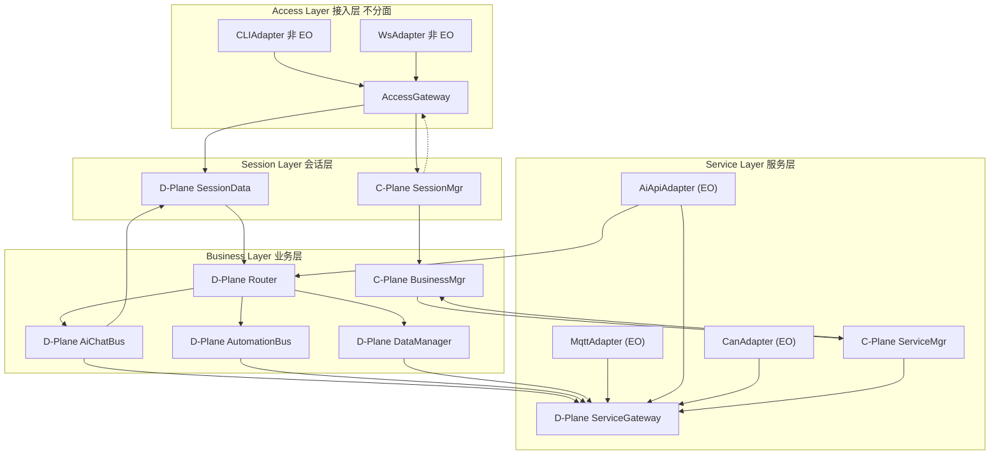
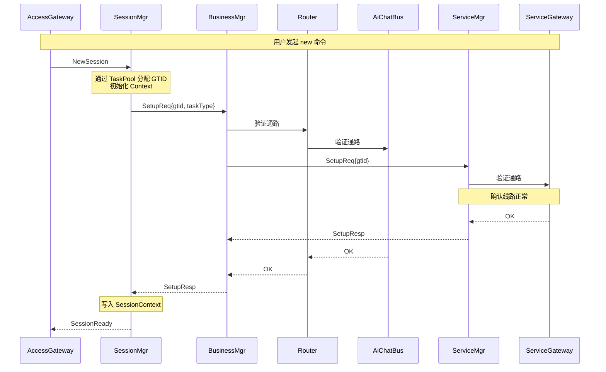
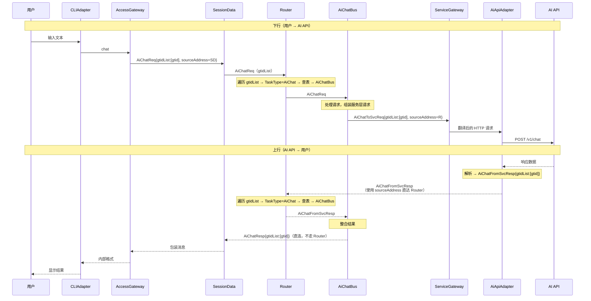
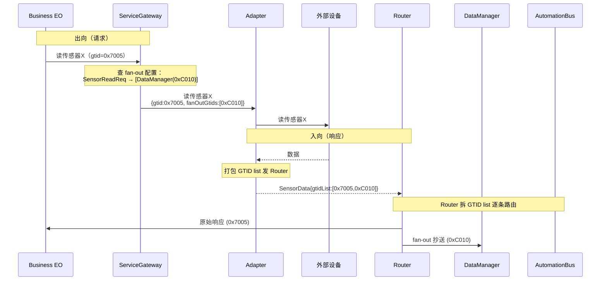

# Flow Hub

> 一个基于 Actor 模型的消息驱动嵌入式编排平台  
> 版本：v0.3  |  最后更新：2026-06-15

---

## 1. 项目定位

Flow Hub 是一个基于 Actor 模型的消息驱动嵌入式编排平台。它通过统一的消息抽象和无状态的计算单元（EO）将任意外部资源——AI API、智能家居设备、工业总线、视觉处理单元等——纳入统一的消息路由和规则引擎下进行编排。

系统不预设应用场景。智能家居、工业控制、边缘 AI 编排、多协议桥接均为其可能的应用方向。

**核心特征**：
- 全异步消息驱动，无共享状态，天然无锁
- 无状态计算单元 + 外部上下文，支持热备切换和独立单元测试
- 静态内存池，禁止运行时堆分配，内存行为完全可预测
- 设计上预留框架抽象层，未来可切换底层运行时（待实现）

---

## 2. 适用硬件

| 部署 Profile | 目标平台 | 运行时 |
|-------------|---------|--------|
| **Full** | Cortex-A76/A55（如 RK3588），或 x86-64 | CAF + Linux |
| **Standard** | Cortex-A72/A76（如树莓派 4/5） | CAF + Linux |
| **Minimal** | Cortex-A7/A53（如全志 H3/V3s） | CAF + Linux（裁剪编译） |
| **Real-Time** | Cortex-R（如 R5/R8）+ RTOS | 轻量级事件循环（待实现）|

系统目标平台为 Cortex-A 系列（Linux），通过预留的框架抽象层保留向 Cortex-R（RTOS）的迁移路径。Cortex-M 系列不列入——内存限制过大。

---

## 3. 核心设计理念

### 3.1 EO —— 最小业务逻辑单元

EO(Entity Object) 是本架构中最小的独立业务逻辑单元，采用 Actor 模型作为并发范式——每个 EO 是**消息驱动的、无状态的、仅通过消息与外界通信**的计算实体。

| 特性 | 说明 |
|------|------|
| **纯消息驱动** | EO 仅通过收发消息与外界交互，不暴露同步调用接口 |
| **无状态** | EO 不保存持久化业务状态，所有状态存储在外部上下文（Context）中 |
| **内部串行** | 每个 EO 内的消息处理是串行的（由底层 EO 运行时保证），无锁安全 |
| **EO 间并行** | 不同 EO 可部署在不同 CPU 核上，运行时的 work-stealing 线程池自动调度 |
| **职责单一** | 一个 EO 只负责一类独立业务功能 |
| **故障隔离** | 单个 EO 崩溃仅影响其所属业务 |

### 3.2 上下文 —— 状态的唯一存储位置

所有业务状态存储在分层上下文中，EO 本身为零状态计算单元。

| 上下文层级 | 存储内容 | 维护者 |
|-----------|---------|--------|
| **SessionContext** | 会话 ID → 业务地址映射、会话状态 | SessionMgr |
| **BusinessContext** | 业务实例 → 服务层业务 EO 地址、运行状态、规则列表、设备数据（DataManager 写入） | BusinessMgr |
| **ServiceContext** | 设备注册表、Adapter 注册表、fan-out 配置 | ServiceMgr |

**原子性规则**：所有上下文修改必须与消息发送原子绑定，禁止在消息处理中间过程中修改上下文。日志/可观测性数据的写入不受此约束。

### 3.3 消息 —— 唯一的通信载体

系统中所有通信均通过消息完成。所有消息统一携带两个字段：

| 字段 | 类型 | 含义 |
|------|------|------|
| **gtidList** | `vector<uint16_t>` | 目标 GTID 列表（通常 1 个，fan-out 时多个）。Router 遍历列表逐条路由 |
| **sourceAddress** | `EoAddress` | 回复地址——接收方回消息时直接用 `sendTo(msg.sourceAddress, resp)` |

**核心路由规则**：仅发往 Business 层 D 面 EO 的消息经 Router 中转，其他方向全部物理直连。

```
发给 Business D 面 EO：
  发送方 ──sendTo(Router, {gtidList: [gtid], sourceAddress, ...})──▶
    Router 遍历 gtidList，对每个 GTID 提取 TaskType 位查表 → delegateTo(target, msg)

从 Business D 面 EO 发出：
  AiChatBus ──sendTo(target, {gtidList: [gtid], sourceAddress, ...})──▶ 直连
```

**`sourceAddress` 填入规则**：

| 消息方向（发送方所在层） | sourceAddress 填什么 | 原因 |
|------------------------|---------------------|------|
| Session 层 → Business D 面 EO（经 Router） | `myAddress()` | 让 Business EO 直连回复到 Session 层 |
| Business D 面 EO → 外（直连） | Router 地址 | 让对端回复时经 Router 查表回到 Business 层 |
| Service 层 → 外（直连） | 无实质影响，可填 Gateway 地址 | Service 层发出的均为响应，不期待回复 |

**Router 定位**：Router 是 Business Layer D 面的一个 EO，不是全局路由设施。它遍历消息头中的 `gtidList`，对每个 GTID 提取 TaskType 位查表路由。单 GTID 就是遍历一次，fan-out 就是遍历多次——逻辑完全统一。

### 3.4 内存模型

| 特性 | 说明 |
|------|------|
| **静态内存池** | 系统预分配固定大小的消息内存池，所有消息均从池中申请 |
| **禁止运行时堆分配** | 业务路径上禁止 new / malloc，内存行为完全可预测 |
| **框架管理生命周期** | 消息的创建、传递、释放由底层框架接管，业务 EO 不感知 |
| **Fire-and-Forget 模式** | 发送方发出消息后不保留引用、不等待确认、不负责释放 |

当前采用 Fire-and-Forget 模式（发射后不管）。关于应用层消息确认重传机制的设计评估，参见架构决策记录 ADR-007。

---

## 4. 架构总览：一层接入 + 三层两面



### 各层一句话定位

| 层 | 职责 | 分面 |
|----|------|------|
| **接入层** | 怎么连进来——把外部消息翻译成内部格式 | 不分面 |
| **会话层** | 谁在说话——管会话、管消息收发 | C: 会话生命周期（重心）/ D: 消息包装转发 |
| **业务层** | 要干什么——所有业务逻辑在这里 | C: 资源分配 / D: 路由+业务+规则引擎+数据管理（重心） |
| **服务层** | 谁能干活——对接 AI、米家、Modbus、NPU 等 | C: 设备生命周期 / D: 统一外部服务入口+协议适配 |

> **Session Layer 的不对称性**：重心在 C 面。"会话"天然是控制面概念——身份、生命周期、窗口关联、状态持久化。D 面（SessionData）的作用是剥离非控制类的杂活（消息包装、返回路径管理），让 Mgr 集中精力做控制决策。这与 Business Layer 相反——Business Layer 的重心在 D 面，因为"路由"天然是数据面概念。
>
> **Window 与会话**：多个 Window（来自不同 Adapter 的连接窗口）可以属于同一个 Session。用户从 CLI 和 WebSocket 同时接入，共享同一段对话——这就是同一 Session 下的多个 Window。Window 与会话的映射由 SessionMgr 管理。
>
> **所有流都有 GTID**：所有进入系统的流都携带 GTID——不管发起者是人、物、还是 Mgr。设备上报数据的 GTID 由 ServiceMgr 在配置时附加。流没有归属 → 无法暂停、无法调整频率、无法查询历史——因此每条流都必须关联一个 GTID。

---

## 5. 各层 EO 部署

```
Access Layer（接入层 · 不分面）
├── CLIAdapter               stdin/stdout -> 内部格式（非 EO，独立线程）
├── WsAdapter                WebSocket -> 内部格式（非 EO，独立线程）
└── AccessGateway            分拣：控制指令 -> SessionMgr / 数据消息 -> SessionData

Session Layer（会话层）
├── C-Plane: SessionMgr      会话创建/销毁，与 BusinessMgr 交互，维护 SessionContext
└── D-Plane: SessionData     消息包装（填 gtidList + sourceAddress），转发至 Router

Business Layer（业务层）
├── C-Plane: BusinessMgr     资源分配、选择业务 EO、维护路由 context 和 BusinessContext
└── D-Plane: Router          GTID 路由：提取 TaskType 位查表，delegate 零拷贝转发
             AiChatBus       单 AI 对话
             AiPanelBus      多 AI 讨论（裁判模式，未来）
             SceneBus        场景管理
             AutomationBus   规则引擎（跨生态设备编排核心）
             DataManager     设备数据落地 + 冷热切换 + 老化（纯数据 EO，不参与编排）

Service Layer（服务层）
├── C-Plane: ServiceMgr      设备发现、连接管理、维护设备注册表、配置 Adapter 注册表与 fan-out 配置
└── D-Plane: ServiceGateway   统一外部服务入口——维护 Adapter 注册表（出向：按消息类型/targetAi 找 Adapter）和 fan-out 配置（出向时预判入向 fan-out 需求，将额外 GTID 嵌入请求）
             MqttAdapter      纯协议翻译：内部消息 <-> MQTT（EO, kMayBlock）
             AiApiAdapter     纯协议翻译：内部消息 <-> HTTP（EO, kMayBlock）
             CanAdapter       CAN Bus 协议适配（预留，EO, kMayBlock）
             ModbusAdapter    Modbus RTU/TCP（预留，EO, kMayBlock）
             NPUAdapter       NPU 推理结果接入（预留，EO, kMayBlock）
```

### Service Layer D 面

所有外部设备通过 Adapter 翻译为内部消息后，经由 ServiceGateway 进入系统。Adapter 地位平等，协议差异完全封装在 Adapter 内部。

**Service 层 Adapter 是 EO**：驱动源头为内部消息（收到内部 EO 消息后，主动向外部发起 HTTP/MQTT/CAN 等请求，原地阻塞等待回复）。`kMayBlock=true` 编译期标签使 CAF 以独立线程（detached）创建，阻塞不影响共享调度池。这与 Access 层 Adapter 不同——Access Adapter 的驱动源头是外部事件（stdin、WebSocket 帧），无法要求外部世界按 CAF 消息协议发送，因此 Access Adapter **不是 EO**，运行在独立线程/事件循环中，通过 `anonSendTo` 注入 actor 系统。

**Gateway 与 Router 的分发依据不同**：Gateway 按消息类型或消息内字段（如 `targetAi`）做映射——出向找 Adapter，fan-out 决定额外 GTID。Router 仅按 GTID 位运算做路由——不读消息内容，不改消息体。

**fan-out 实现方式**：Gateway 在转发出向请求时查 fan-out 配置，若该请求的响应需要额外通知其他 GTID，则将额外 GTID 列表嵌入出向消息（有 fan-out 时通过 move 大字段 + 新增小字段构造新消息；无 fan-out 时 `delegate` 零拷贝转发）。Adapter 透传该列表至入向消息，打包发给 Router。Router 收到 GTID list 后逐条拆开路由。详见 §6.5。

---

## 6. 通信规则

### 6.1 路由规则

| 通信方向 | 规则 |
|---------|------|
| **Adapter → AccessGateway** | 同层（接入层内部），直接通信 |
| **AccessGateway → SessionMgr / SessionData** | 跨层（接入层→会话层），地址在启动时下发 |
| **C 面 → C 面** | 相邻层点对点直连，推荐 `requestThen` |
| **→ Business D 面 EO** | 经 Business 层 Router 中转。gtidList 中每个 GTID 的 TaskType 位即路由键 |
| **Business D 面 EO → 外** | 物理直连。下层地址记录在 EO 实例成员中（系统 setup 时由 BusinessMgr 下发） |
| **同层 D 面 ↔ D 面** | 直接通信，目标地址记录在对应业务的上下文中 |
| **C 面 ↔ 同层 D 面** | 可直接通信 |
| **Adapter → Router** | 入向直达。Adapter 使用请求中携带的 `sourceAddress`（Router 地址）直接回复 |
| **Adapter → ServiceGateway** | 服务层内部（出向请求路径），直接通信 |
| **ServiceMgr → ServiceGateway** | C 面配置 D 面（Adapter 注册表/fan-out 配置），直接通信 |
| **ServiceGateway → Adapter** | 服务层内部。Gateway 按 Adapter 注册表查目标地址，直接转发 |

> **判定原则**：只有 Business 层 D 面 EO 有地址映射（热备/负载均衡）需求，因此只有发往它们的消息需要经 Router。其他层当前无此需求，直连即可。若将来其他层也引入热备，应在该层内增设自己的 Router。

### 6.2 Router 与 GTID 路由

Router 是 Business Layer D 面的一个 EO，职责是遍历消息头中的 `gtidList`，对每个 GTID 提取 TaskType 位，将消息投递给正确的 Business D 面 EO 实例。

```
消息头 gtidList 可包含 1 个或多个 GTID：
  单 GTID（常规）：gtidList = [0x7001]  → 遍历一次，路由到 AiChatBus
  多 GTID（fan-out）：gtidList = [0x7005, 0xC010] → 遍历两次，分别路由

Router 对每个 GTID：
  查表键 = GTID >> 6（即 TaskType 字段，见 ADR-0008）

示例：
  GTID 0x7001 → TaskType = 0x01C0 (AiChat) → 查表 → AiChatBus 实例
  GTID 0xC010 → TaskType = 0x0300 (Session) → 查表 → DataManager
```

**热备切换**：Router 将 TaskType → 活跃实例的映射更新为新的物理地址。上游完全无感——GTID 不变，TaskType 不变，只有 Router 内部的映射变了。

**负载均衡**：Router 维护每个 TaskType 对应的实例池，从池中任选一个实例投递。因 Context 存储在共享的 TaskPool 中，不同实例处理同一 GTID 的消息无碍——原子性规则保证同一时刻仅一条消息在处理。

**消息流转**：Router 使用 `delegate()` 零拷贝转发，不修改消息体。`sourceAddress` 字段由发送方预先填入，Router 不干预。

### 6.3 会话建立流程（Setup）



- 全程 C 面对 C 面；SessionMgr 通过 TaskPool 分配 GTID 并初始化 Context
- BusinessMgr 将 SetupReq 同时发往 Router/Business EO 和服务层，验证全链路通路
- 通路确认后 SessionMgr 写入 SessionContext，会话就绪

### 6.4 AI 对话消息流转



> **关键点**：消息头为 `gtidList + sourceAddress`。Router 遍历 gtidList 对每个 GTID 提取 TaskType 位查表，单 GTID（常规）和 多 GTID（fan-out）逻辑完全统一。出向消息物理直连。

- AiChatBus 直接通过 ServiceGateway 调用 AI API，Gateway 查 Adapter 注册表转发给对应 Adapter
- Adapter 入向使用消息头中的 `sourceAddress`（Business D 面 EO 发送时填入 Router 地址）直接回复 Router
- AiApiAdapter 是纯粹的协议翻译器（内部消息 ↔ HTTP），不参与路由决策
- **消息负载**：`AiChatRequest` 携带 `{targetAi, messagesJson, temperature}`，其中 `messagesJson` 为 OpenAI 兼容的 `messages` 数组 JSON 字符串。对话历史存于 `AiChatContext.messagesBuffer`（静态定长内存），AiChatBus 纯追加写入、整段拷贝发出，不做解析（详见 ADR-0015）

### 6.5 设备数据流与 fan-out

**fan-out 实现机制（Gateway 出向预埋）**：

1. Gateway 收到 Business EO 的出向请求（如"读传感器X"）
2. Gateway 查 fan-out 配置：该请求的响应是否需要额外通知 DataManager / AutomationBus
3. 若需要 fan-out，Gateway 将额外 GTID 列表嵌入出向消息（如 `fanOutGtids: [0xC010]`）。大字段（string、vector）通过 `std::move` 零拷贝转移，仅新增小字段的微小分配。若无需 fan-out，走 `delegate()` 零拷贝转发
4. Adapter 做出向 HTTP 请求、收 HTTP 响应——透传 GTID list，不理解其含义
5. Adapter 入向时将所有信息（含 GTID list）打包发给 Router（`sourceAddress` 直达）
6. Router 收到消息，遍历 gtidList，每个 GTID 独立路由到对应 Business EO



**fan-out 配置**由 ServiceMgr 下发至 Gateway，格式为 `出向消息类型 → [额外 GTID 列表]`。AI Chat 类消息通常无需 fan-out，传感器读数等常需要抄送 DataManager。

**消费者有两种获取数据的方式**：

| 方式 | 路径 | 优点 | 缺点 |
|---|---|---|---|
| **快路径** | 从 BusinessContext 读 DataManager 写入的冷数据 | 零消息开销，同 Flow 内完成 | 数据可能有延迟 |
| **慢路径** | Adapter fan-out 实时推送 | 实时，拿到最新值 | 跨 Flow，有消息开销 |

**选择权在消费者。**

- fan-out 配置集中在 Gateway，Adapter 只做透传——不感知全局拓扑
- Adapter 的订阅管理（MQTT topic、CAN 信号过滤）由 ServiceMgr 直接指挥
- 行为表逻辑（条件判断、触发规则）在 AutomationBus 中完成

---

## 7. 可扩展性

### 7.1 协议扩展

新增智能家居协议或工业总线：新增 Adapter → 向 ServiceGateway 注册 → ServiceMgr 配置 Adapter 注册表与 fan-out 配置。业务层零修改。

### 7.2 跨生态编排

AutomationBus 作为规则引擎，不感知底层协议。一个规则可同时触发米家、Modbus、HomeKit 设备的动作，也可响应 NPU 视觉检测、定时器等任意事件源。规则以结构化文本（JSON）下发，支持运行中增删改。

### 7.3 Router 分阶段演进

| Phase | 版本 | 功能 |
|-------|------|------|
| **Phase 1** | 1.0 | 基础路由：TaskType 与物理 EO 一一对应，EO 崩溃后原地重启 |
| **Phase 2** | 1.x | 负载监控：收集各 EO 运行时指标（纯观测） |
| **Phase 3** | 2.0 | 多实例并行：同一业务多 EO 实例并行处理，动态扩缩 |
| **Phase 4** | 2.x | 热备：活跃 EO 崩溃后 Router 瞬间重映射 TaskType 到热备 EO |

---

## 8. 框架抽象层（设计预留，待实现）

> **当前状态**：Demo 阶段直接使用 CAF 原生接口。框架抽象层将在核心链路跑通后实施。

设计意图：业务代码不直接依赖 CAF。通过在 CAF 之上封装一层薄抽象（`src/fw/`），将底层框架的依赖限制在 `src/fw/caf_impl/` 目录中。未来切换运行时（如 SObjectizer 或 RTOS 事件循环）只需替换该目录。

具体抽象接口将在 Demo 完成后根据实际用到的 CAF 能力进行设计。

---

## 9. 关键设计决策

| 决策 | 结论 | 理由 |
|------|------|------|
| 无状态 EO + 外部上下文 | 采用 | 热备切换无感、可独立测试、状态可审计 |
| 静态内存池 + 禁止堆分配 | 采用 | 确定性内存行为，嵌入式友好 |
| GTID + sourceAddress 消息头 | 采用 | gtidList 支持单/多目标，Router 遍历路由逻辑统一 |
| D 面消息经 Router 中转 | 采用 | 消息路径可控，映射集中管理 |
| 仅业务层支持多实例 | 采用 | 会话层 I/O 密集不占 CPU，服务层瓶颈在外部设备 |
| 应用层消息确认重传 | 废弃 | EO 崩溃不应是常态，根因应在代码质量与测试中消除 |
| 消息体持久化缓存 | 废弃 | 仅用于配合重传，重传不做则无意义 |
| Service 层统一入口 ServiceGateway | 采用 | 所有 Adapter 平等注册，协议差异封装在 Adapter 内部 |
| AiApiSvc / MiHomeSvc / DeviceGateway 取消 | 采用 | Adapter → Gateway → Router 直达 Business EO，不需要中间 EO |
| DataManager 放在 Business 层 | 采用 | 跨层写 Context 破坏分层隔离，同层内读写是自然的架构约束 |
| Session Layer C 面重 D 面轻 | 采用 | "会话"是控制面概念；D 面剥离杂活供 Mgr 专注决策 |
| 所有流都携带 GTID | 采用 | 无归属则无法暂停/调频/查历史 |

完整决策分析记录在 `docs/adr/` 目录下。

---

## 10. 目录结构

```
flowHub/
├── docs/
│   ├── architecture/
│   │   └── OVERVIEW.md
│   └── adr/
│
├── src/
│   ├── fw/                         <- 框架抽象层（待实现）
│   ├── utils/                      <- 工具
│   │
│   ├── access/                     <- 接入层（不分面）
│   │   ├── AccessGateway.hpp / cpp
│   │   ├── CliAdapter.hpp / cpp
│   │   ├── WsAdapter.hpp / cpp    （未来）
│   │   └── CMakeLists.txt
│   │
│   ├── CPlane/                     <- 控制面
│   │   ├── SessionMgr.hpp / cpp
│   │   ├── BusinessMgr.hpp / cpp
│   │   ├── ServiceMgr.hpp / cpp
│   │   └── CMakeLists.txt
│   │
│   ├── DPlane/                     <- 数据面
│   │   ├── session/
│   │   │   ├── SessionData.hpp / cpp
│   │   │   └── CMakeLists.txt
│   │   │
│   │   ├── business/
│   │   │   ├── Router.hpp / cpp
│   │   │   ├── AiChatBus.hpp / cpp
│   │   │   ├── AutomationBus.hpp / cpp
│   │   │   ├── DataManager.hpp / cpp
│   │   │   └── CMakeLists.txt
│   │   │
│   │   └── service/
│   │       ├── ServiceGateway.hpp / cpp

│   │       ├── AiApiAdapter.hpp / cpp
│   │       ├── MqttAdapter.hpp / cpp
│   │       ├── CanAdapter.hpp / cpp        （预留）
│   │       └── CMakeLists.txt
│   │
│   └── main.cpp
│
├── CMakeLists.txt
├── .clang-format
├── .gitignore
├── README.md                       <- 本文件
└── LICENSE
```

---

## 11. 编码约定

| 约定 | 说明 |
|------|------|
| `.hpp` + `.cpp` 同目录 | 一个模块的所有文件集中在一个目录下 |
| `<>` 包外部库，`""` 包自己的代码 | |
| `#include` 相对 `src/` 写路径 | `#include "fw/message.hpp"` |
| 每个模块一个 `CMakeLists.txt` | 管该模块的生产代码和单元测试 |
| `ut/` 放 `_ut.cpp`，`ut/mocks/` 放 `mock_*.hpp` | 单元测试约定 |

---

## 12. 命名规范

| 角色 | 命名规则 | 示例 |
|------|---------|------|
| 控制面（C-Plane） | `功能 + Mgr` | SessionMgr, BusinessMgr, ServiceMgr |
| 会话层数据面（D-Plane） | `功能 + Data` | SessionData |
| 业务层数据面（D-Plane） | `功能 + Bus` | AiChatBus, AutomationBus, SceneBus |
| 业务层路由 | `Router` | 固定名称 |
| 业务层数据管理 | `DataManager` | 固定名称 |
| 服务层统一外部入口 | `ServiceGateway` | 固定名称 |
| 协议适配器 | `协议 + Adapter` | CLIAdapter, WsAdapter, MqttAdapter, AiApiAdapter |
| 接入层网关 | `AccessGateway` | 固定名称 |

---

