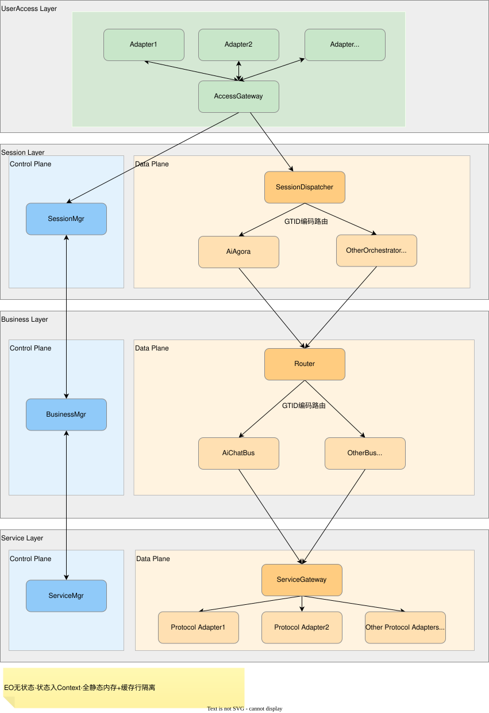

# FlowHub

**C++17 消息驱动的确定性编排框架** —— 控制面/数据面分离、无状态执行单元、静态内存、消息按 ID O(1) 路由。

基于 C++17 与 CAF（C++ Actor Framework）的确定性任务编排框架：FlowHub 自身代码路径全静态内存、无锁并发、任务状态随 Context 流转。覆盖架构、编码、测试、CI 与文档——24 篇 ADR 决策记录、399 个 GTest/gMock 用例全绿、Gerrit + Jenkins CI 门禁。

## 核心亮点

- 确定性执行：FlowHub 自身代码路径全静态内存、零堆分配、无锁并发，执行路径确定、任务状态隔离
- 消息驱动路由：16-bit GTID 统一寻址，路由层 O(1) 定位执行单元；执行单元无状态，状态随任务 Context 流转
- 工程证据：24 篇 ADR 决策记录、消息与 Context 由 `.mt` 定义 + 脚本生成、`GTest/gMock` 399 用例全绿、Gerrit + Jenkins CI

## 架构

FlowHub 按能力划分为四层（UserAccess / Session / Business / Service），消息以 GTID 为统一寻址标识，执行单元无状态、相互解耦。task 没有固定路径：可由用户消息或系统内部发起，完成方式取决于任务类型（回用户通道 / 触发外部服务 / 更新任务 Context）。



*控制面（C）负责生命周期管理，数据面（D）负责消息路由与任务执行；GTID 路由：入口 SessionDispatcher → 编排器（如 AiAgora）→ D 面 Router 按 gtid>>6 分发至业务 EO；执行单元无状态，状态随 Context 流转。*

- **编排器（如 AiAgora）**：负责编排的一类执行单元，是每个任务的调度中枢，把任务拆解后以请求-响应方式分派给业务 EO，子任务协调集中在此
- **子任务执行单元（业务 EO）**：子任务的实际执行者，接收消息、执行具体业务逻辑并返回结果；无状态、可独立测试
- **入口路由**：路由层按 GTID 掩码 O(1) 定位业务 EO，组件之间不持对方地址、相互解耦

**编排能力演示**（`docs/alg/alg00006`）：以多 AI 话题辩论为验证场景，编排器（AiAgora）将一个话题拆解为携带多个目标 GTID 的子任务，经 Router 分发后由执行单元按各自任务 Context 处理（当前为单个 AiChatBus 顺序处理各子任务，未涉及多实例负载均衡）；编排器按序收齐各子任务应答、合并入累积对话历史，并自动推进「发言 → 评判 → 下一轮」的状态循环，无需前端介入。该演示验证了编排器「拆解任务、分派执行单元、汇总并推进状态」的编排能力。

## 工程实践与证据

24 篇 ADR（0007-0030）记录全部关键设计决策，含选型理由与替代方案分析；重点：ADR-0009 Context 存储与访问规则、ADR-0011 GTID 路由键、ADR-0016 用 EoEnv 隐藏 CAF。完整索引见[文档](#构建与文档)。

- **零堆分配**：FlowHub 自身代码路径运行时无 `malloc/new`，内存边界编译期静态确定
- **无锁并发**：Context 随任务流转，执行单元间无共享可变状态，无需互斥锁
- **缓存行隔离**：任务上下文按缓存行对齐，防伪共享
- **代码生成**：消息与 Context 由 `.mt` 定义，脚本统一生成序列化、任务类型与缓存行对齐；只需定义数据，重复代码交给脚本

## 工程工作流

- **代码评审**：更改经自建 Gerrit 的 patchset 评审控制，不使用 GitHub Pull Request
- **自动验证**：提交自动触发本地 Jenkins 构建，执行编译、单测、格式与静态检查
- **需求关联**：feature 开发任务用 GitHub issue 跟踪，commit message 按 `[Feature号] 描述 (#issue号)` 格式，由 `scripts/check-issue-ref.sh` 校验：本地 commit hook 以 `--strict` 拦截不合规提交，CI 中仅警告，实现提交到需求的可追溯

相关脚本与 systemd 服务均位于 `scripts/` 目录。

commit message 示例：

```text
[FT00XX] 描述 (#87)
```

## 演进

主干基于 Linux + CAF，单测全绿。OSAL 跨 OS 抽象层（Linux ↔ Zephyr RTOS）接口已冻结、未合入主干，为跨平台适配预留；落地规划见[路线图](docs/roadmap.md)。

## 构建与文档

```bash
cmake -B build && cmake --build build -j && ctest --test-dir build
```

构建依赖标准工具链（CMake/GCC）与 CAF（C++ Actor Framework，CMake 自动获取），验证环境 Linux 主机，单测全绿（399 个用例，GTest/gMock）是工程可复现的最小证明。

[ADR 索引](docs/adr/README.md) · [路线图](docs/roadmap.md)

