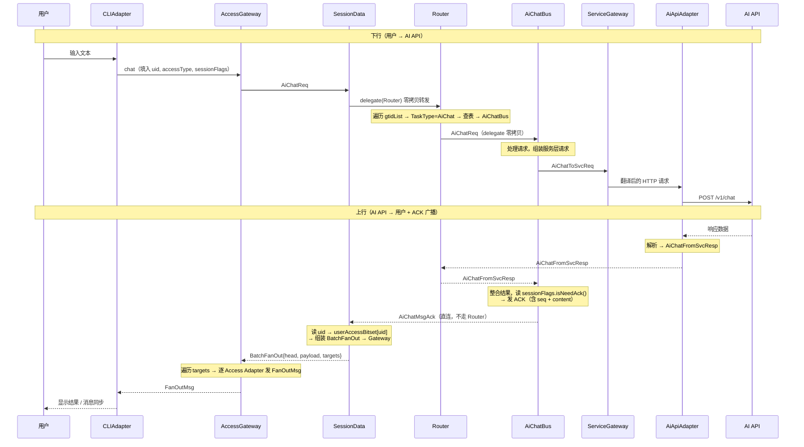
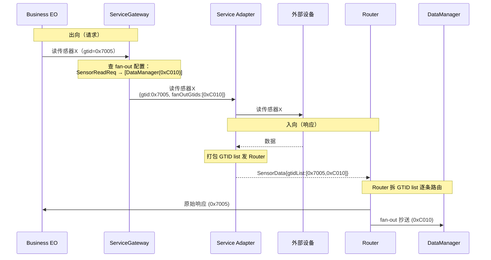

# Flow Hub

> 一个基于 Actor 模型的消息驱动嵌入式编排平台  
> 版本：v0.4  |  最后更新：2026-07-01

---

## 1. 项目定位

Flow Hub 是一个基于 Actor 模型的消息驱动嵌入式编排平台。它通过统一的消息抽象和无状态的计算单元（EO）将任意外部资源——AI API、智能家居设备、工业总线、视觉处理单元等——纳入统一的消息路由和规则引擎下进行编排。

系统不预设应用场景。智能家居、工业控制、边缘 AI 编排、多协议桥接均为其可能的应用方向。

**核心特征**：
- 全异步消息驱动，无共享状态，天然无锁
- 无状态计算单元 + 外部上下文，支持热备切换和独立单元测试
- 静态内存池，禁止运行时堆分配，内存行为完全可预测
- 设计上预留框架抽象层，未来可切换底层运行时（待实现）

---

## 2. 适用硬件

| 部署 Profile | 目标平台 | 运行时 |
|-------------|---------|--------|
| **Full** | Cortex-A76/A55（如 RK3588），或 x86-64 | CAF + Linux |
| **Standard** | Cortex-A72/A76（如树莓派 4/5） | CAF + Linux |
| **Minimal** | Cortex-A7/A53（如全志 H3/V3s） | CAF + Linux（裁剪编译） |
| **Real-Time** | Cortex-R（如 R5/R8）+ RTOS | 轻量级事件循环（待实现）|

系统目标平台为 Cortex-A 系列（Linux），通过预留的框架抽象层保留向 Cortex-R（RTOS）的迁移路径。Cortex-M 系列不列入——内存限制过大。

---

## 2.5 当前实现状态

> **策略**：文档先行，代码后跟。README 描述目标架构全貌，以下标注当前代码实际状态。

| 组件/机制 | 状态 | 说明 |
|----------|------|------|
| CliAdapter | ✅ 已实现 | stdin/stdout ↔ 内部消息 |
| SessionMgr | ✅ 已实现 | 注册/登录/GTID 分配回收，username→userId 映射 |
| SessionData | ✅ 已实现 | 基础消息转发 |
| Router | ✅ 已实现 | GTID → TaskType 路由 |
| AiChatBus | ✅ 已实现 | 单 AI 对话 |
| BusinessMgr | ✅ 已实现 | 基础资源分配 |
| ServiceGateway | ✅ 已实现 | 基础出向转发 |
| AiApiAdapter | ✅ 已实现 | HTTP ↔ 内部消息翻译 |
| AccessGateway | ✅ 已实现 | 接入层消息分拣 + fan-out |
| ServiceMgr | 📐 设计中 | 设备注册表、fan-out 配置管理 |
| WsAdapter | 📐 设计中 | WebSocket 接入 |
| AutomationBus / DataManager | 📐 设计中 | 规则引擎、设备数据管理 |
| MqttAdapter / CanAdapter 等 | 🔮 预留 | 工业协议适配 |
| SessionFlags 编译期标志 | 📐 设计中 | ADR-0021 |
| BatchFanOut / FanOutMsg | 📐 设计中 | ADR-0022 |
| 哨兵 GTID 新建 Task | 📐 设计中 | ADR-0023 |
| 注册/登录/登出完整生命周期 | � 进行中 | 注册+登录已实现（6.2~6.3），登出/注销待实现 |

---

## 3. 核心设计理念

### 3.1 EO —— 最小业务逻辑单元

EO(Entity Object) 是本架构中最小的独立业务逻辑单元，采用 Actor 模型作为并发范式——每个 EO 是**消息驱动的、无状态的、仅通过消息与外界通信**的计算实体。

| 特性 | 说明 |
|------|------|
| **纯消息驱动** | EO 仅通过收发消息与外界交互，不暴露同步调用接口 |
| **无状态** | EO 不保存持久化业务状态，所有状态存储在外部上下文（Context）中 |
| **内部串行** | 每个 EO 内的消息处理是串行的（由底层 EO 运行时保证），无锁安全 |
| **EO 间并行** | 不同 EO 可部署在不同 CPU 核上，运行时的 work-stealing 线程池自动调度 |
| **职责单一** | 一个 EO 只负责一类独立业务功能 |
| **故障隔离** | 单个 EO 崩溃仅影响其所属业务 |

### 3.2 上下文 —— 状态的唯一存储位置

所有业务状态存储在分层上下文中，EO 本身为零状态计算单元。

| 上下文层级 | 存储内容 | 维护者 |
|-----------|---------|--------|
| **SessionContext** | 会话 ID → 业务地址映射、会话状态 | SessionMgr |
| **BusinessContext** | 业务实例 → 服务层业务 EO 地址、运行状态、规则列表、设备数据（DataManager 写入） | BusinessMgr |
| **ServiceContext** | 设备注册表、Adapter 注册表、fan-out 配置 | ServiceMgr |

> **维护者 vs 读写者**：表中"维护者"指该 Context 的**生命周期管理者**（C 面 Mgr，负责 Context slot 的创建/销毁/分配）。**运行时读写**由 D 面 EO 执行（如 DataManager 写 BusinessContext 中的设备数据，AiChatBus 读写 AiChatContext），详见 ADR-0009。

**原子性规则**：所有上下文修改必须与消息发送原子绑定，禁止在消息处理中间过程中修改上下文。日志/可观测性数据的写入不受此约束。

### 3.3 消息 —— 唯一的通信载体

系统中所有通信均通过消息完成。每条消息由 **UserHead**（消息头）+ **payload**（业务数据）组成。UserHead 包含以下字段：

| 字段 | 类型 | 填入者 | 说明 |
|------|------|--------|------|
| **uid** | `uint16_t` | Adapter（编译期 appType + 运行时 userId 拼装） | 用户标识：`[userId:8][AppType:8]`，全链路携带 |
| **gtidList** | GTID 列表 | 前端（或 SessionMgr 分配后替换） | 目标 GTID 列表；序列号位全 1 = 新 Task 哨兵（ADR-0023） |
| **accessType** | `AccessType` | Adapter（编译期常量） | 源 Adapter 标识；Gateway 回程路由键；fan-out 位图索引；源 Adapter 排除依据（ADR-0024） |
| **appType** | `AppType` | Adapter（编译期常量，accessType 隐含） | 控制面请求携带；SessionMgr 闸门校验 + UserRecord 索引 |
| **sessionFlags** | `SessionFlags` | Adapter（`make<AppType>()` 编译期构造） | 行为标志（如 `needAck`）；Business EO 运行时读取（ADR-0021） |

payload 为业务相关内容，当前（AI 对话）即为上下文或请求/响应的对话内容（string），后续按需扩展。

> **已废弃**：`sourceAddress` 字段已移除。回程路由由 Gateway 的 `adapterTable_[accessType]` 查表完成，源标识由 `accessType` 天然承担。详见 ADR-0024。

> **命名为 UserHead 的缘由**：GTID 按发起方分为三类（ADR-0008）——**User**（0x7，用户直接发起的 Task）、System（0x0，系统运维 Task）、Other（0xC，系统发起的业务 Task）。`UserHead` 承载的信息（uid、accessType、appType、sessionFlags）是 **Adapter 发出、由用户操作触发的消息所特有的**——Adapter 知道用户是谁（uid）、通过哪种方式接入（accessType）、用的是哪种前端（appType）、需要哪些行为标志（sessionFlags）。系统自发消息（如 setup）不需要这些字段。原名 `MsgHead`（ADR-0014），后由 ADR-0020 更名为 `UserHead` 以体现这一语义区分。

### 3.4 三层类型体系

系统定义三种正交的类型来标识"怎么连"、"做什么"、"哪个任务"：

| 类型 | 含义 | 可见范围 | 定义位置 |
|------|------|----------|----------|
| **AccessType** | Adapter 唯一标识——(AppType × 连接方式) 组合 | Access 层 + Gateway + SessionData（fan-out 位图） | `common/type/` |
| **AppType** | 客户端功能集合——"做什么"（AiChat / SmartHome / …） | 前端 + Adapter + SessionMgr（闸门校验）+ SessionData（上下文同步判断） | `common/type/` |
| **TaskType** | 原子业务任务——"哪个任务"（SingleAiChat / DeviceMonitor / …） | 全链路（GTID 高位编码） | `common/type/` |

**关键约束**：
- AppType 止于 Session 层——Business 层及以下不可见 AppType。AppType 特有的行为要求由 Adapter 编译期编码进 `sessionFlags`（ADR-0021）
- 无 super TaskType——TaskType 正交，不存在组合多个 TaskType 的新 TaskType
- 每个 AppType 包含一组正交 TaskType（编译期常量），SessionMgr 据此做 `NewTask` 闸门校验

### 3.5 uid 编码

```
uid = uint16_t，编码 [userId:8][AppType:8]

MAX_USERS = 64（userId 上限）
MAX_APP_TYPES = 64
MAX_UID = 65536（全 16 位空间）
```

实际有效的 uid 只有 64 × 64 = 4096 个。`MAX_UID` 设为 65536 而非 4096，是 **SessionData 以空间换时间** 的刻意设计：

- **SessionData** 的 `userAccessBitset` 是 `uint64_t[65536]` 的 flat 数组（512 KB），直接用 uid 作为下标索引，无需解码。fan-out 是高频数据面操作，省一次 `[userId][appType]` 拆解换零翻译，性能更优。512 KB 的额外空间可接受。
- **SessionMgr** 则不同——其 `UserRecord` 每项包含 `name[32]` + `static_vector<GTID, 128>`，若 flat 开 65536 项会浪费大量内存（~2 GB），不可接受。因此 SessionMgr 采用 `UserRecord[64][64]` 二维表，uid 解码为 `[userId][appType]` 后查表。

uid 自携带 AppType（`uid & 0xFF`），无需额外字段或查表。同一真实用户在不同 AppType 下使用相同 username → 同一 userId（高 8 位同），不同 AppType（低 8 位不同）→ 不同 uid。fan-out 自动隔离。

### 3.5.1 username 与 userId 设计原则

**username 是 userId 级别的**——注册只建立 `username ↔ userId` 映射，与 appType 无关。注册成功后该 userId 自动获得所有 appType 的登录权限。各 appType 的 `UserRecord[userId][appType]` 在首次登录时 lazy 初始化。

| 规则 | 说明 |
|------|------|
| **username 唯一性** | `usernameToId_`（`unordered_map<string, UserId>`）保证 username 全局唯一 |
| **username 最长 12 字符** | `kMaxUsernameLen = 12`，超长注册直接拒绝。利于固定大小数据结构 |
| **无反向索引** | 不维护 `userId → username` 映射。反向查找仅注销时用到，遍历 `usernameToId_`（≤64 项）即可，O(64) 可接受 |
| **注册与 appType 解耦** | 注册只需 username，不需要 appType。`UserRegisterReq.head.appType` 仅用于拼装响应中的 `uid` |

### 3.6 内存模型

| 特性 | 说明 |
|------|------|
| **静态内存池** | Context 从预分配的静态内存池中申请，杜绝运行时堆分配 |
| **禁止手动堆分配** | 业务路径上禁止手动 new / malloc，内存行为完全可预测 |
| **框架管理生命周期** | 消息的创建、传递、释放由底层 CAF 框架接管，业务 EO 不感知 |
| **Fire-and-Forget 模式** | 发送方发出消息后不保留引用、不等待确认、不负责释放 |

> **消息内存**：当前消息直接使用 CAF 框架原生的消息分配机制，未纳入静态内存池。消息进静态池列为远期设计计划。手动 `new` 绝对禁止。

---

## 4. 架构总览：一层接入 + 三层两面

```
┌──────────────────────────────────────────────────────────────┐
│ Access Layer（接入层 · 不分面）                               │
│                                                              │
│   CLIAdapter ──── AccessGateway ──── WsAdapter               │
│                                                              │
└──────────────────────────────────────────────────────────────┘

┌──────────────────────────────────────────────────────────────┐
│ Session Layer（会话层）                                       │
│                                                              │
│   C-Plane: SessionMgr           D-Plane: SessionData         │
│   · 身份管理（username↔userId）  · 下行透传（delegate）        │
│   · GTID 分配/回收              · 上行 fan-out（BatchFanOut）  │
│   · 闸门校验                    · 上下文同步触发               │
│   · 登录/登出/注销              · BatchCounter 管理            │
│                                                              │
└──────────────────────────────────────────────────────────────┘

┌──────────────────────────────────────────────────────────────┐
│ Business Layer（业务层）                                      │
│                                                              │
│   C-Plane: BusinessMgr          D-Plane:                     │
│   · 资源分配                      Router ─┬─ AiChatBus        │
│   · BusinessContext 维护                 ├─ AutomationBus     │
│                                          └─ DataManager      │
│                                                              │
└──────────────────────────────────────────────────────────────┘

┌─────────────────────────────────────────────────────────────────┐
│ Service Layer（服务层）                                          │
│                                                                 │
│   C-Plane: ServiceMgr           D-Plane:                        │
│   · 设备注册表               ServiceGateway ─┬─ MqttAdapter │
│   · fan-out 配置                           ├─ AiApiAdapter │
│                                            └─ CanAdapter   │
│                                                                 │
└─────────────────────────────────────────────────────────────────┘
```

> 层间消息流转路径见 [§6 通信规则](#6-通信规则)。

### 各层一句话定位

| 层 | 职责 | 分面 |
|----|------|------|
| **接入层** | 怎么连进来——把外部消息翻译成内部格式 | 不分面 |
| **会话层** | 谁在说话——管身份、管会话、管消息收发 | C: 会话生命周期（重心）/ D: 消息转发 + 上行 fan-out |
| **业务层** | 要干什么——所有业务逻辑在这里 | C: 资源分配 / D: 路由+业务+规则引擎+数据管理（重心） |
| **服务层** | 谁能干活——对接 AI、米家、Modbus、NPU 等 | C: 设备生命周期 / D: 统一外部服务入口+协议适配 |

> **Session Layer 的不对称性**：重心在 C 面。"会话"天然是控制面概念——身份、生命周期、状态持久化。D 面（SessionData）的职责是消息转发和上行 fan-out——下行透传（零决策），上行广播（读 `userAccessBitset` 组装 `BatchFanOut`）。这与 Business Layer 相反——Business Layer 的重心在 D 面。
>
> **所有流都有 GTID**：所有进入系统的流都携带 GTID——不管发起者是人、物、还是 Mgr。流没有归属 → 无法暂停、无法调整频率、无法查询历史——因此每条流都必须关联一个 GTID。

---

## 5. 各层 EO 部署

```
Access Layer（接入层 · 不分面）
├── CLIAdapter               stdin/stdout -> 内部格式（非 EO，独立线程）
├── WsAdapter                WebSocket -> 内部格式（非 EO，独立线程）
└── AccessGateway            分拣：控制类→SessionMgr / 哨兵GTID→SessionMgr / 数据类→SessionData

Session Layer（会话层）
├── C-Plane: SessionMgr      身份管理（username↔userId）、GTID 分配/回收、闸门校验、
│                            登录/登出/注销流程、UserRecord 维护
└── D-Plane: SessionData     下行透传（delegate Router，零拷贝）、上行 fan-out
│                            （读 userAccessBitset → 组装 BatchFanOut → Gateway）、
│                            上下文同步触发、BatchCounter 管理

Business Layer（业务层）
├── C-Plane: BusinessMgr     资源分配、选择业务 EO、维护路由 context 和 BusinessContext
└── D-Plane: Router          GTID 路由：提取 TaskType 位查表，delegate 零拷贝转发
             AiChatBus       单 AI 对话（读 sessionFlags.isNeedAck() 决定是否发 ACK）
             AiPanelBus      多 AI 讨论（裁判模式，未来）
             SceneBus        场景管理
             AutomationBus   规则引擎（跨生态设备编排核心）
             DataManager     设备数据落地 + 冷热切换 + 老化（纯数据 EO，不参与编排）

Service Layer（服务层）
├── C-Plane: ServiceMgr      设备发现、连接管理、维护设备注册表、配置 Adapter 注册表与 fan-out 配置
└── D-Plane: ServiceGateway   统一外部服务入口——维护 Adapter 注册表（出向：按消息类型/targetAi 找 Adapter）和 fan-out 配置（出向时预判入向 fan-out 需求，将额外 GTID 嵌入请求）
             MqttAdapter      纯协议翻译：内部消息 <-> MQTT（EO, kMayBlock）
             AiApiAdapter     纯协议翻译：内部消息 <-> HTTP（EO, kMayBlock）
             CanAdapter       CAN Bus 协议适配（预留，EO, kMayBlock）
             ModbusAdapter    Modbus RTU/TCP（预留，EO, kMayBlock）
             NPUAdapter       NPU 推理结果接入（预留，EO, kMayBlock）
```

### Service Layer D 面

所有外部设备通过 Adapter 翻译为内部消息后，经由 ServiceGateway 进入系统。Adapter 地位平等，协议差异完全封装在 Adapter 内部。

**Service Adapter 是 EO**：驱动源头为内部消息（收到内部 EO 消息后，主动向外部发起 HTTP/MQTT/CAN 等请求，原地阻塞等待回复）。`kMayBlock=true` 编译期标签使 CAF 以独立线程（detached）创建，阻塞不影响共享调度池。这与 **Access Adapter**（CLIAdapter、WsAdapter）不同——Access Adapter 的驱动源头是外部事件（stdin、WebSocket 帧），无法要求外部世界按 CAF 消息协议发送，因此 Access Adapter **不是 EO**，运行在独立线程/事件循环中，通过 `anonSendTo` 注入 actor 系统。

**Gateway 与 Router 的分发依据不同**：Gateway 按消息类型或消息内字段（如 `targetAi`）做映射——出向找 Adapter，fan-out 决定额外 GTID。Router 仅按 GTID 位运算做路由——不读消息内容，不改消息体。

**fan-out 实现方式（下行）**：ServiceGateway 在转发出向请求时查 fan-out 配置，若该请求的响应需要额外通知其他 GTID，则将额外 GTID 列表嵌入出向消息。Service Adapter 透传该列表至入向消息，打包发给 Router。Router 收到 GTID list 后逐条拆开路由。上行 fan-out 采用 BatchFanOut/FanOutMsg 两级机制（ADR-0022）。

---

## 6. 通信规则

### 6.1 路由规则

**基本原则**：

1. **同层内**：C 面与 D 面可通信，D 面内部可通信。Access 层不分面，所有消息经 AccessGateway 中转。

2. **跨层**：只允许同面之间通信——C 面只能发给相邻层的 C 面，D 面只能发给相邻层的 D 面。唯一的例外是 Access 层（不分面），AccessGateway 可同时连接 Session 层的 C 面和 D 面。

3. **D 面入向经 Router/Gateway 中转，出向直发**。这条规则对 Business 层和 Service 层都适用：

   | 方向 | Business 层 | Service 层 |
   |------|------------|-----------|
   | **入向**（消息进入本层 D 面） | 经 Router 中转 | 经 Router 中转（Service Adapter 入向直达 Router） |
   | **出向**（消息离开本层 D 面） | 直发目标 | 经 ServiceGateway 转发至 Service Adapter |

   **例**：BusinessEO 发消息给 Service Adapter → `BusinessEO → ServiceGateway → ServiceAdapter`（出向）。Service Adapter 的应答 → `ServiceAdapter → Router → BusinessEO`（入向）。

4. **Session 层 D 面**只有一个 SessionData 实例，无内部路由——下行 `delegate(Router)` 零拷贝转发，上行组装 `BatchFanOut` 发往 Gateway（ADR-0022）。

5. **C 面纵向链**：`SessionMgr → BusinessMgr → ServiceMgr → ServiceGateway`，相邻层点对点直连。其中 ServiceMgr → ServiceGateway 是 C 面配置 D 面（Service Adapter 注册表、fan-out 配置）。

**路由规则速查**：

| 路径 | 说明 |
|------|------|
| Access Adapter → AccessGateway | 接入层内部 |
| AccessGateway → SessionMgr（控制）/ SessionData（数据） | 跨层，分拣规则见 §6.2 |
| SessionData → Router | D 面下行，delegate 零拷贝 |
| Router → Business EO | 按 GTID TaskType 位查表 |
| Business EO → SessionData | D 面上行（ACK/回复），直连 |
| Business EO → ServiceGateway | D 面出向发往Service，Service层内部经由ServiceGateway中转 |
| ServiceGateway → Service Adapter | Service 层内部出向 |
| Service Adapter → Router | Service 层入向应答，不经 ServiceGateway |
| SessionData → Gateway（BatchFanOut） | 上行 fan-out（ADR-0022） |
| Gateway → Access Adapter（FanOutMsg） | fan-out 拆解分发（ADR-0022） |
| C 面纵向：SM → BM → SVM | 相邻层点对点 |

### 6.2 AccessGateway 分拣规则

AccessGateway 根据消息特征将入向消息路由到不同目标：

| 消息特征 | 路由目标 |
|---------|---------|
| GTID 序列号位全 1（哨兵值，ADR-0023） | SessionMgr（新建 Task） |
| 控制类请求（注册/登录/登出/注销/删除会话） | SessionMgr |
| 带正式 GTID 的数据面请求 | SessionData（正常数据路径） |
| 无 GTID 且非控制类 | 拒绝（返回 `NO_GTID_NEW_TASK` 错误） |

### 6.3 Router 与 GTID 路由

Router 是 Business Layer D 面的一个 EO，职责是遍历消息头中的 `gtidList`，对每个 GTID 提取 TaskType 位，将消息投递给正确的 Business D 面 EO 实例。

```
消息头 gtidList 可包含 1 个或多个 GTID：
  单 GTID（常规）：gtidList = [0x7001]  → 遍历一次，路由到 AiChatBus
  多 GTID（fan-out）：gtidList = [0x7005, 0xC010] → 遍历两次，分别路由

Router 对每个 GTID：
  查表键 = GTID >> 6（即 TaskType 字段，见 ADR-0008）

示例：
  GTID 0x7001 → TaskType = 0x01C0 (AiChat) → 查表 → AiChatBus 实例
  GTID 0xC010 → TaskType = 0x0300 (Session) → 查表 → DataManager
```

**热备切换**：Router 将 TaskType → 活跃实例的映射更新为新的物理地址。上游完全无感——GTID 不变，TaskType 不变，只有 Router 内部的映射变了。

**负载均衡**：Router 维护每个 TaskType 对应的实例池，从池中任选一个实例投递。因 Context 存储在共享的 TaskPool 中，不同实例处理同一 GTID 的消息无碍——原子性规则保证同一时刻仅一条消息在处理。

**消息流转**：Router 使用 `delegate()` 零拷贝转发，不修改消息体。

### 6.4 会话生命周期

#### 注册（纯 C 面）

```
前端 ─RegisterReq{username}─▶ Access Adapter ─▶ Gateway ─▶ SessionMgr
                                                              │
                                         检查 username 是否已注册
                                         从 uidBitset 分配新 userId
                                         初始化 UserRecord[userId][appType]
                                         usernameToId_[username] = userId
                                                              │
前端 ◀──RegisterRsp{userId}── Access Adapter ◀── Gateway ◀────┘
```

注册只分配 userId，不建立连接状态。注册成功后需另行登录。

#### 登录（C 面交互）

```
前端 ─LoginReq{userId}─▶ Access Adapter ─▶ Gateway ─▶ SessionMgr
                                                          │
                                         校验 userId + appType 合法性
                                            │
                                ┌───────────┴───────────┐
                                ▼                       ▼
                           校验不通过               校验通过
                                │                       │
                           拒绝登录                 取出 GTID 列表
                                │                 发 UserLogin{uid, appType, accessType, gtids}
                                │                       │
                                │           ┌───────────┘
                                │           ▼
                                │     SessionData
                                │           │
                                │           ├─ 置 userAccessBitset[uid] 中 accessType 位
                                │           ├─ 统计活跃 adapter 数（0→1 = 冷启动）
                                │           ├─ 判断是否需要数据面预处理
                                │           │
                                │           └─ 回复 SessionMgr：{ activeCount, dataReady }
                                │                       │
                                │           ┌───────────┘
                                │           ▼
                                │      SessionMgr 回复前端
                                │           │
                                │   ┌───────┴───────┐
                                │   ▼               ▼
                                │ dataReady      !dataReady
                                │   │               │
                                │ LoginRsp     LoginRsp{needWait=true}
                                │ 前端可操作    前端等待数据面就绪
                                │                   │
                                │              SessionData 异步推送
                                │              （如历史数据逐条下发）
                                │                   │
                                │              推送完毕 → 发 DataReady 给前端
                                │                   │
                                │              前端收到后可操作
```

**流程要点**：

- **D→C 必须先于 C→前端**：SessionData 的回复是 SessionMgr 响应用户的前提。SessionData 告知 Mgr 数据面是否已就绪（`dataReady`），Mgr 据此决定前端响应内容。
- **三种结果**：
  - 控制面校验不通过 → 拒绝登录。
  - 控制面就绪 + 数据面已就绪 → 前端立即可操作。
  - 控制面就绪 + 数据面未就绪 → 前端进入等待态，直到收到数据面的就绪推送后才开放操作。
- **冷启动对称**：登录时活跃数 0→1（对应登出时活跃数→0 可能触发持久化——未来预留）。
- **首次登录 vs 后续登录**：
  - **首次登录**：`UserRecord` 中 GTID 列表为空 → SessionData 置位后直接回复，不触发额外动作。
  - **后续登录**（用户在其他设备上已有活跃会话）：GTID 列表非空 → SessionData 触发**上下文同步**——从 `batchCounterResources_` 申请 BatchCounter → 组装批量消息（含所有历史 GTID）→ 发往 Router → Router 逐 GTID `delegate` 给对应 Business EO → 各 Business EO 返回历史数据 → **直回源 Adapter**（不经 fan-out，只有刚登录的前端需要这份数据）。上下文同步完成后 SessionData 回复 `dataReady=true`。
- Access Adapter 收到 LoginRsp 后将 userId 记入 `userToConn_`。

#### 登出（C 面交互）

```
前端 ─LogoutReq─▶ Access Adapter ─▶ Gateway ─▶ SessionMgr
                                                   │
                                    发 UserLogout{uid, accessType}
                                                   │
                                                   ▼
                                             SessionData
                                                   │
                                                   ├─ 清 userAccessBitset[uid] 中 accessType 位
                                                   ├─ 统计剩余活跃 adapter 数
                                                   └─ 回复 SessionMgr：{ activeCount }
                                                   │
                                                   ▼
前端 ◀──LogoutRsp── Access Adapter ◀── Gateway ◀── SessionMgr
```

- Access Adapter **暂不**清除 `userToConn_[userId]`——等回路确认（收到 LogoutRsp）后再清。
- 活跃数归零时，未来可触发 context 持久化（当前预留）。
- 断连触发的自动登出流程与此完全一致。

#### 注销（纯 C 面）

```
前端 ─DeleteReq─▶ Access Adapter ─▶ Gateway ─▶ SessionMgr
                                                   │
                                    遍历 UserRecord[userId][appType] 回收所有 GTID
                                    清空 UserRecord，移除 usernameToId_ 映射
                                    释放 userId（清 uidBitset 对应位）
                                                   │
                                                   ▼
前端 ◀──DeleteRsp── Access Adapter ◀── Gateway ◀────┘
```

D 面不感知注销——uid 已删除，后续无消息到达。userId 被复用时，SessionMgr 先发 `UserReset{uid}` 给 SessionData 清零历史 bitset。

#### 新建 Task（捆绑请求，ADR-0023）

不存在独立的"建空会话"控制请求。前端第一条消息携带**哨兵 GTID**（seq 位全 1）+ 首条数据内容一起发出：

```
前端 ─哨兵GTID + 数据─▶ Access Adapter ─▶ Gateway
                                              │
                             检测 seq 全 1 → SessionMgr
                                              │
                             闸门校验：AppType 是否包含该 TaskType
                             分配正式 GTID，写入 UserRecord
                             替换哨兵值为正式 GTID，连同原始数据
                                              │
                                              ▼
                                        SessionData → Router → BusinessEO
                                                                   │
                                                  处理首条数据，发 ACK
                                                                   │
                                                                   ▼
                                                         SessionData → BatchFanOut → 各 Access Adapter
```

其他端收到含陌生 GTID 的 ACK 即知新会话已创建——**ACK fan-out 即通知**，无需单独的"会话创建通知"。源端收到 ACK 即确认会话创建成功 + 消息已处理。

#### 删除会话（C 面交互）

纯控制请求，走三角形路径——SessionMgr 做裁判，SessionData 做通知：

```
前端 ─DeleteSessionReq{gtid}─▶ Access Adapter ─▶ Gateway ─▶ SessionMgr
                                                                │
                                               校验 gtid 属于该 user
                                               从 GTID 池回收，从 UserRecord 移除
                                               将结果发给 SessionData
                                                                │
                                                                ▼
                                                          SessionData
                                                                │
                                               组装 BatchFanOut（含源端）
                                               → Gateway → 各 Access Adapter
```

源 Access Adapter 收到即确认删除成功；其他端收到后从会话列表移除该 GTID。

---

## 7. 典型消息流示例

> §6 定义了通用通信规则和生命周期。本章以两个具体流程序列图展示规则如何落地。

### 7.1 AI 对话消息流



> **下行**：全链路仅转发——Adapter 填入 uid/accessType/sessionFlags 后原样透传，SessionData `delegate(Router)` 零拷贝。**不做任何 fan-out**。
>
> **上行**：AiChatBus 处理完毕、写 context、分配 seq 后，读 `sessionFlags.isNeedAck()` 决定是否发 ACK。ACK 和 AI 回复经 SessionData → `BatchFanOut` → Gateway → 各 Access Adapter 广播。Access Adapter 据 `head.accessType` 判断自己是源还是其他端，发"送达通知"或"同步通知"给前端。
>
> **消息负载**：`AiChatRequest` 携带 `{targetAi, messagesJson, temperature}`，对话历史存于 `AiChatContext.messagesBuffer`（静态定长内存），AiChatBus 纯追加写入、整段拷贝发出，不做解析（详见 ADR-0015）。

### 7.2 设备数据流与 fan-out

**下行 fan-out**（Service 层，ADR-0013）：ServiceGateway 在转发出向请求时查 fan-out 配置，若该请求的响应需要额外通知其他 GTID（如传感器读数抄送 DataManager），则将额外 GTID 列表嵌入出向消息。Service Adapter 透传该列表至入向消息，打包发给 Router。Router 收到 GTID list 后逐条拆开路由。

**上行 fan-out**（Session 层，ADR-0022）：ACK 和 AI 回复等上行广播采用 BatchFanOut/FanOutMsg 两级机制，见 §6.5。两种 fan-out 互不取代，各司其职。



**fan-out 配置**由 ServiceMgr 下发至 Gateway，格式为 `出向消息类型 → [额外 GTID 列表]`。AI Chat 类消息通常无需下行 fan-out，传感器读数等常需要抄送 DataManager。

**消费者有两种获取数据的方式**：

| 方式 | 路径 | 优点 | 缺点 |
|---|---|---|---|
| **快路径** | 从 BusinessContext 读 DataManager 写入的冷数据 | 零消息开销，同 Flow 内完成 | 数据可能有延迟 |
| **慢路径** | Service Adapter fan-out 实时推送 | 实时，拿到最新值 | 跨 Flow，有消息开销 |

**选择权在消费者。**

---

## 8. 可扩展性

### 8.1 协议扩展

新增智能家居协议或工业总线：新增 Adapter → 向 ServiceGateway 注册 → ServiceMgr 配置 Adapter 注册表与 fan-out 配置。业务层零修改。

### 8.2 跨生态编排

AutomationBus 作为规则引擎，不感知底层协议。一个规则可同时触发米家、Modbus、HomeKit 设备的动作，也可响应 NPU 视觉检测、定时器等任意事件源。规则以结构化文本（JSON）下发，支持运行中增删改。

### 8.3 AppType 扩展

新增前端 App 类型：定义新 `AppType` 枚举值 → 在 `SessionFlags::make<>()` 的 switch 中加映射 → 新建对应 Access Adapter（每种需要的连接方式一个）→ 在 SessionMgr 的 AppType→TaskType 集合中声明包含关系。Business 层零修改。

### 8.4 Router 分阶段演进

| Phase | 版本 | 功能 |
|-------|------|------|
| **Phase 1** | 1.0 | 基础路由：TaskType 与物理 EO 一一对应，EO 崩溃后原地重启 |
| **Phase 2** | 1.x | 负载监控：收集各 EO 运行时指标（纯观测） |
| **Phase 3** | 2.0 | 多实例并行：同一业务多 EO 实例并行处理，动态扩缩 |
| **Phase 4** | 2.x | 热备：活跃 EO 崩溃后 Router 瞬间重映射 TaskType 到热备 EO |

---

## 9. 框架抽象层（设计预留，待实现）

> **当前状态**：Demo 阶段直接使用 CAF 原生接口。框架抽象层将在核心链路跑通后实施。

设计意图：业务代码不直接依赖 CAF。通过在 CAF 之上封装一层薄抽象（`src/fw/`），将底层框架的依赖限制在 `src/fw/caf_impl/` 目录中。未来切换运行时（如 SObjectizer 或 RTOS 事件循环）只需替换该目录。

具体抽象接口将在 Demo 完成后根据实际用到的 CAF 能力进行设计。

---

## 10. 关键设计决策

完整架构决策记录在 `docs/adr/` 目录下。

| 编号 | 决策 | 状态 |
|------|------|------|
| [0008](./docs/adr/0008-gtid.md) | 任务标识采用 GTID（General Task Identifier） | 已采纳 |
| [0009](./docs/adr/0009-gtid-context-rules.md) | GTID Context 访问规则、物理存储与映射表同步协议 | 已采纳 |
| [0010](./docs/adr/0010-eo-context-type.md) | EO 强制声明 ContextType 模板参数 | 已采纳 |
| [0011](./docs/adr/0011-gtid-routing-key.md) | GTID 替代虚拟 ID 作为路由键，Router 定位为层内设施 | 已采纳 |
| [0012](./docs/adr/0012-remove-protocol-gateway.md) | 取消 ProtocolGateway，统一为 ServiceGateway | 已采纳 |
| [0013](./docs/adr/0013-fan-out-gateway-embed.md) | fan-out 实现机制——Gateway 出向预埋 GTID 列表（下行 fan-out） | 已采纳 |
| [0014](./docs/adr/0014-gtid-list-header.md) | 消息头统一为 gtidList | 已采纳 |
| [0015](./docs/adr/0015-ai-chat-context-message.md) | AI Chat Context 消息格式 | 已采纳 |
| [0016](./docs/adr/0016-eo-env-wrapper.md) | 引入 EoEnv 包装层，彻底隐藏 CAF | 已采纳 |
| [0017](./docs/adr/0017-mayblock-compile-time-tag.md) | 编译期标签 `kMayBlock` 自动选择 Actor 线程模式 | 已采纳 |
| [0018](./docs/adr/0018-eo-zero-copy-delegate.md) | EoBase 消息转发零拷贝优化 | 已采纳 |
| [0019](./docs/adr/0019-router-route-table.md) | Router 路由表实现——定长数组 + Config/Reconfig 协议 | 已采纳 |
| [0020](./docs/adr/0020-seq-version-control.md) | AiChatBus 序列号版本控制（抢占式请求） | 已采纳 |
| [0021](./docs/adr/0021-session-flags-compile-time.md) | SessionFlags 编译期 flag 映射模式 | 已采纳 |
| [0022](./docs/adr/0022-batch-fanout-two-level.md) | BatchFanOut/FanOutMsg 两级上行广播机制 | 已采纳 |
| [0023](./docs/adr/0023-bundled-request-gtid-sentinel.md) | 捆绑请求 + GTID 哨兵值新建 Task 协议 | 已采纳 |
| [0024](./docs/adr/0024-head-accesstype-reuse.md) | head.accessType 复用替代 sourceAddress 字段 | 已采纳 |

### 其他关键决策（未成文为独立 ADR）

| 决策 | 结论 | 理由 |
|------|------|------|
| 无状态 EO + 外部上下文 | 采用 | 热备切换无感、可独立测试、状态可审计 |
| 静态内存池 + 禁止手动堆分配 | 采用 | 确定性内存行为，嵌入式友好 |
| 仅业务层支持多实例 | 采用 | 会话层 I/O 密集不占 CPU，服务层瓶颈在外部设备 |
| Adapter 按 (AppType × 连接方式) 独立 | 采用 | Adapter 内 client 天然同质，fan-out 零过滤 |
| 同一 Access Adapter 内 user 单连接 | 采用 | O(1) 直查，砍掉多连接管理复杂度 |
| userId 按 AppType 隔离 | 采用 | fan-out 自动隔离，无需 AppType 过滤 |
| 消息落地后才同步（ACK 上行广播） | 采用 | ACK 在 AiChatBus 写 context 后发出，消除不一致窗口 |
| Business 层不感知 AppType | 采用 | AppType 止于 Session 层，行为差异由 sessionFlags 编码 |
| 应用层消息确认重传 | 废弃 | EO 崩溃不应是常态，根因应在代码质量与测试中消除 |
| 消息体持久化缓存 | 废弃 | 仅用于配合重传，重传不做则无意义 |

---

## 11. 目录结构

```
flowHub/
├── docs/
│   ├── adr/                        <- 架构决策记录（0008~0024）
│   ├── architecture/               <- 架构文档（待建设）
│   ├── access-session-design-checklist.md   <- Access-Session 设计决策路线图（工作文档）
│   └── access-session-design-iteration-log.md <- 迭代记录（工作文档）
│
├── src/
│   ├── fw/                         <- 框架抽象层（待实现）
│   ├── common/                     <- 公共定义（类型、消息、SessionFlags 等）
│   ├── utils/                      <- 工具
│   │
│   ├── access/                     <- 接入层（不分面）
│   │   ├── AccessGateway.hpp / cpp
│   │   ├── CliAdapter.hpp / cpp
│   │   ├── WsAdapter.hpp / cpp    （未来）
│   │   └── CMakeLists.txt
│   │
│   ├── CPlane/                     <- 控制面
│   │   ├── SessionMgr.hpp / cpp
│   │   ├── BusinessMgr.hpp / cpp
│   │   ├── ServiceMgr.hpp / cpp
│   │   └── CMakeLists.txt
│   │
│   ├── DPlane/                     <- 数据面
│   │   ├── session/
│   │   │   ├── SessionData.hpp / cpp
│   │   │   └── CMakeLists.txt
│   │   │
│   │   ├── business/
│   │   │   ├── Router.hpp / cpp
│   │   │   ├── AiChatBus.hpp / cpp
│   │   │   ├── AutomationBus.hpp / cpp
│   │   │   ├── DataManager.hpp / cpp
│   │   │   └── CMakeLists.txt
│   │   │
│   │   └── service/
│   │       ├── ServiceGateway.hpp / cpp
│   │       ├── AiApiAdapter.hpp / cpp
│   │       ├── MqttAdapter.hpp / cpp
│   │       ├── CanAdapter.hpp / cpp        （预留）
│   │       └── CMakeLists.txt
│   │
│   └── main.cpp
│
├── CMakeLists.txt
├── .clang-format
├── .gitignore
├── README.md                       <- 本文件
└── LICENSE
```

---

## 12. 编码约定

| 约定 | 说明 |
|------|------|
| `.hpp` + `.cpp` 同目录 | 一个模块的所有文件集中在一个目录下 |
| `<>` 包外部库，`""` 包自己的代码 | |
| `#include` 相对 `src/` 写路径 | `#include "fw/message.hpp"` |
| 每个模块一个 `CMakeLists.txt` | 管该模块的生产代码和单元测试 |
| `ut/` 放 `_ut.cpp`，`ut/mocks/` 放 `mock_*.hpp` | 单元测试约定 |

---

## 13. 命名规范

| 角色 | 命名规则 | 示例 |
|------|---------|------|
| 控制面（C-Plane） | `功能 + Mgr` | SessionMgr, BusinessMgr, ServiceMgr |
| 会话层数据面（D-Plane） | `功能 + Data` | SessionData |
| 业务层数据面（D-Plane） | `功能 + Bus` | AiChatBus, AutomationBus, SceneBus |
| 业务层路由 | `Router` | 固定名称 |
| 业务层数据管理 | `DataManager` | 固定名称 |
| 服务层统一外部入口 | `ServiceGateway` | 固定名称 |
| 协议适配器 | `协议 + Adapter` | CLIAdapter, WsAdapter, MqttAdapter, AiApiAdapter |
| 接入层网关 | `AccessGateway` | 固定名称 |

---

> **设计参考**：Access-Session 层的完整设计决策路线图见 `docs/access-session-design-checklist.md`（9 轮确认，全部通过）。迭代记录见 `docs/access-session-design-iteration-log.md`。

