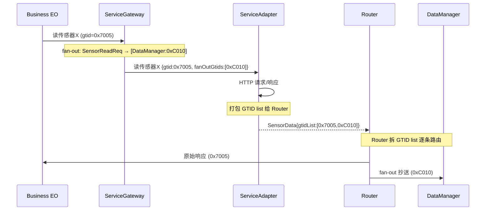

# ADR-0013：fan-out 实现机制——ServiceGateway 出向预埋 GTID 列表

| 状态 | 日期 | 决策者 |
|------|------|--------|
| 已采纳 | 2026-06-16 | 韵启龙 |

> **修订（2026-07-01）**：本文描述的 ServiceGateway 出向预埋 GTID 列表机制**仍适用于 Service 层下行 fan-out**。**上行广播**（ACK / AI 回复到各 Access Adapter）是不同层（Session 层）、不同方向的需求，已由 [ADR-0022](../adr/0022-batch-fanout-two-level.md) 的 BatchFanOut/FanOutMsg 两级机制承担。两者互不取代，各司其职。

---

## 背景

系统中存在一条消息需要通知多个 Business EO 的场景（fan-out）。例如温度传感器读数既需要发给请求方（SceneBus）做实时判断，也需要抄送 DataManager 存储历史数据。

问题：**fan-out 决策在哪一层做、由哪个组件执行、通过什么机制传递信息。**

---

## 约束

1. **Service Adapter 不应知道全局拓扑**：Service Adapter 是纯协议翻译器，不知道"温度数据还要抄送 DataManager"这种编排层知识
2. **Router 仅按 GTID 路由**：Router 的职责是 `GTID >> 6 → Business EO`，不改消息体、不读消息业务内容。让它做 fan-out 需要它理解消息类型，破坏单一职责
3. **ServiceGateway 按消息类型/字段分发**：ServiceGateway 在出向管理 Service Adapter 注册表（`消息类型 → Service Adapter`），按消息内容字段做映射是其天然职责范围
4. **入向路径尽量短**：大部分消息不需要 fan-out，不应为少数场景付出全量中转代价

---

## 决策

**ServiceGateway 在出向时预判 fan-out 需求，将额外 GTID 列表嵌入出向请求消息。Service Adapter 透传该列表至入向消息，打包发给 Router。Router 拆 GTID list 逐条路由。**

```
出向（请求）：
  Business EO → ServiceGateway
    ServiceGateway 查 fan-out 配置 → 将 fanOutGtids 嵌入消息
    （无 fan-out: delegate 零拷贝 / 有 fan-out: move 大字段 + 新增小字段）
    → Service Adapter → 外部设备

入向（响应）：
  外部设备 → Service Adapter
    Service Adapter 从请求上下文取出 fanOutGtids（纯透传）
    → 打包 GTID list 发给 Router
    → Router 拆 list 逐 GTID 路由到对应 Business EO
```

**完整链路（以传感器读数为 fan-out 为例）**：



---

## 为什么不是其他方案

### 方案 A：ServiceGateway 入向做 fan-out（被否决）

```
入向：Service Adapter → ServiceGateway → 查 fan-out 配置 → 多发几条给 Router
```

**否决理由**：所有入向消息都多一次 ServiceGateway 中转（~1μs 进程内投递）。fan-out 是低频需求，为此付出全局代价不划算。

### 方案 B：Router 做 fan-out（被否决）

```
入向：Service Adapter → Router → 查 fan-out 配置 + GTID 路由 → 转发给多个 EO
```

**否决理由**：Router 需要理解消息类型才能决定 fan-out（"这条读数需要抄送 DataManager 吗？"），与其"仅按 GTID 位运算路由"的职责冲突。

### 方案 C：Service Adapter 拆 GTID list（被否决）

```
入向：Service Adapter → 遍历 GTID list → 逐条发 Router
```

**否决理由**：Service Adapter 需要理解 GTID 结构并决定"发几条"，超出纯翻译职责。最终方案改为 Service Adapter 打包发给 Router，由 Router 拆 list——Router 拆 GTID 是其路由职责的自然延伸。

---

## 影响

- **ServiceGateway**：增加 fan-out 配置表（`出向消息类型 → [额外 GTID]`），出向时查表嵌入 GTID list。无 fan-out 走 `delegate()` 零拷贝，有 fan-out 通过 `std::move` 转移大字段、仅新增 GTID list。配置由 ServiceMgr 下发
- **Service Adapter**：增加一个透传字段（`fanOutGtids`），出入向原样携带。不拆解、不遍历、不决策
- **Router**：行为小幅扩展——收到消息后检查 GTID list 字段，若存在则逐 GTID 拆开独立路由。不改消息体
- **消息格式**：出向/入向消息增加可选字段 `fanOutGtids`（GTID 列表，可为空）
- **入向路径**：Service Adapter 打包 GTID list 发 Router（通过 `sourceAddress`），不经 ServiceGateway。无 fan-out 场景路径一致
- **性能**：无 fan-out 场景 ServiceGateway 走 `delegate()` 零拷贝；有 fan-out 场景 ServiceGateway 只做大字段 `std::move`（O(1)）+ 小字段新增（几十字节），无深拷贝

---

## 与其他 ADR 的关系

- ADR-0011 确定了 `sourceAddress` 规则：Business D 面 EO 发送消息时填入 Router 地址——这使得 Service Adapter 入向能直达 Router
- ADR-0012 取消了 ProtocolGateway，fan-out 决策现在唯一归属 ServiceGateway

---

## 修订记录

| 日期 | 修订 |
|------|------|
| 2026-06-16 | 初稿，采纳 |
