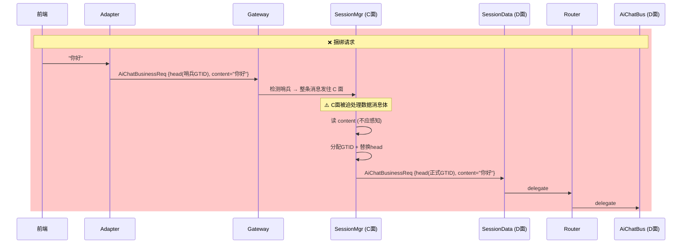
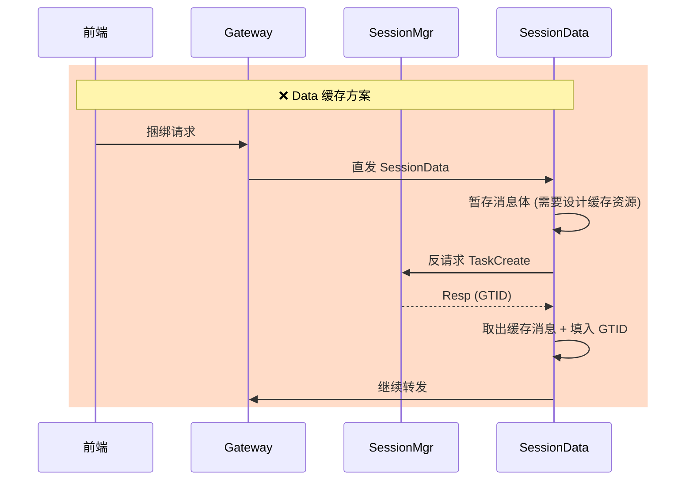
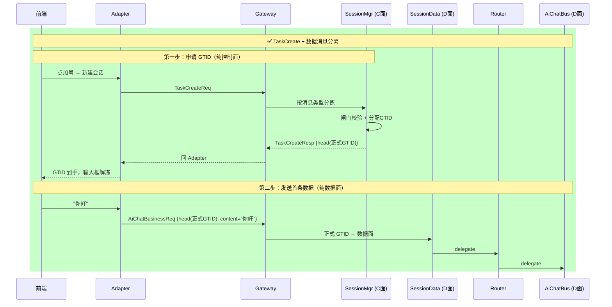

# ADR-0023：捆绑请求 + GTID 哨兵值新建 Task 协议

| 状态 | 日期 | 决策者 |
|------|------|--------|
| 已采纳 | 2026-07-01 | — |

---

## 背景

在 AiChat 等对话类应用中，不存在独立的"建空会话"操作——用户的第一条消息本身就是会话的起点。前端发起对话时，总是携带第一条消息内容，不存在"先建 session、再发消息"的两步操作。

传统的"先申请资源、再使用资源"的两段式协议（`NewSessionReq` → `NewSessionResp` → `SendMessage`）会引入额外的一次往返延迟，且与前端交互模型不匹配——用户在输入框里打完字就发送了，中间没有"建会话"这个步骤。

需要一种协议，让第一条消息同时完成"新建 Task（分配 GTID）"和"传递首条数据"两件事——捆绑请求（bundled request）。

## 决策

### GTID 哨兵值：序列号位全 1 = 新 Task 请求

在 GTID 编码中约定一个特殊哨兵值：

```
GTID 编码：[TaskType:高位][SequenceNumber:低位]

正常 GTID：TaskType 位如实填写，SequenceNumber 由 SessionMgr 分配（非全 1）
哨兵 GTID：TaskType 位如实填写，SequenceNumber 位全 1（通用公式 `(taskType << 6) | 0x3F`；例：TaskType=AiChat(0x01C0) 时哨兵值 = 0x703F）
```

前端发捆绑请求时：
1. 填入哨兵 GTID——`taskType` 位指示"我要新建哪种 Task"，`seq` 位全 1 表示"这是新建请求"
2. 消息中同时携带首条数据内容
3. Gateway 检测到哨兵 GTID → 路由到 SessionMgr（而非 SessionData）

### 完整流程

```
前端 → Adapter → Gateway → SessionMgr（控制面处理）
                              │
                              │ 1. 闸门校验：AppType 是否包含该 TaskType
                              │ 2. 分配正式 GTID
                              │ 3. 写入 UserRecord[userId][appType]
                              │ 4. 将正式 GTID 替换哨兵值，连同原始数据转发
                              │
                              ▼
                         SessionData → Router → BusinessEO（数据面执行）
                                                      │
                                                      │ 处理首条数据
                                                      │ 写 context、分配 seq
                                                      │ 发 ACK
                                                      │
                                                      ▼
                                              SessionData → BatchFanOut → 各 Adapter
```

### ACK fan-out 即通知

BusinessEO 处理完毕后发 ACK → SessionData → `BatchFanOut` → 各 Adapter。其他端收到含陌生 GTID 的 ACK，自然知道新会话已创建。**不需要单独的"会话创建通知"fan-out**。

源端收到 ACK 即确认：session 创建成功 + 消息已处理——一条 ACK 完成两项确认。

### Gateway 分拣规则更新

| 消息特征 | 路由目标 |
|---------|---------|
| GTID 序列号位全 1（哨兵值） | SessionMgr（新建 Task） |
| 无 GTID 且非哨兵 | 拒绝（Router 返回 `NO_GTID_NEW_TASK` 错误） |
| 带正式 GTID | SessionData（正常数据路径） |
| 控制类请求（注册/登录/登出/注销） | SessionMgr |

## 备选方案

| 方案 | 否决原因 |
|------|----------|
| 独立 `NewSessionReq` 控制请求（两步式） | 引入额外往返延迟；AiChat 场景无独立建会话概念；前端交互模型不匹配 |
| 独立 `NewSessionReq` + 首条数据分开发送 | 前端需等待建会话响应后才能发首条消息——用户体验差 |
| 空 GTID 标识新 Task | 丢失 TaskType 信息，Gateway 无法判断路由到哪个 TaskType |
| 新消息类型 `BundledRequest` 包装 | 增加消息类型数量；哨兵值方案复用现有 GTID 字段，改动最小 |

## 影响

- **GTID 编码定义**：新增"序列号位全 1 = 哨兵值"的约定。GTID 分配时需跳过哨兵值对应的序列号。
- **Gateway**：新增哨兵 GTID 检测逻辑，据此分拣到 SessionMgr。
- **SessionMgr**：新增捆绑请求处理流程——闸门校验 + 分配 GTID + 替换哨兵值 + 连同数据转发 SessionData。
- **前端协议**：新建 Task 时填入哨兵 GTID，无需单独的建会话请求。收到 ACK 即确认会话创建成功。
- **错误码**：新增 `NO_GTID_NEW_TASK`——前端未声明新 Task 又无正式 GTID。

---

## 修订记录

| 日期 | 修订 |
|------|------|
| 2026-07-01 | 初稿，采纳 |
| 2026-07-03 | 废弃捆绑请求方案，改为 TaskCreate + TaskDelete 对称协议 |

### 2026-07-03：废弃捆绑请求，改为独立 TaskCreate/TaskDelete

#### 问题根源

捆绑请求的完整序列图：



核心缺陷：**SessionMgr 必须持有完整数据消息**，知道消息类型（`AiChatBusinessReq`）、结构体字段（`content`）。这违反了 C/D 分层——C 面职责是 GTID 管理，不应感知业务消息结构。未来每新增一种数据消息类型，SessionMgr 都需要修改。

#### 被否决的修正方案

**方案 A — Gateway 中介**
Gateway 拆包只发 head 给 SessionMgr → 拿到 GTID → 填入原消息 → 转发 SessionData。
否决理由：Gateway 本只是消息分拣器，不应承担 GTID 替换和消息体改写。

**方案 B — Data 缓存 + 反请求**



否决理由：
1. SessionData 需设计缓存资源（存储不定数量待处理消息），改动大
2. 异步等待引入消息乱序风险（等待 GTID 期间用户又发新消息）
3. SessionMgr 无端多了反向依赖（Data → Mgr）

#### 最终方案 — TaskCreate



**决策**：采用独立 TaskCreate/TaskDelete 对称协议。多一次往返的代价可接受——仅新建会话时发生，前端交互自然（加号 → 输入框解冻）。

**哨兵 GTID 保留**：`TaskCreateReq` 中 `head.gtidList` 仍需填入哨兵值（序列号位全 1），此时尚无正式 GTID。仅作为 head 占位标识，不再承担"捆绑数据请求"语义。

#### 影响

| 项 | 旧（捆绑请求） | 新（TaskCreate） |
|----|:---:|:---:|
| 消息类型 | 复用业务消息 + 哨兵 GTID | 新增 `TaskCreateReq/Resp`、`TaskDeleteReq/Resp` |
| SessionMgr 感知数据体 | ⚠️ 是 | ✅ 否 |
| Gateway 哨兵检测 | ⚠️ 需检测 GTID 位 | ✅ 仅按消息类型分拣 |
| 前端交互 | 发送即创建 | 加号创建 + 输入框解冻 |
