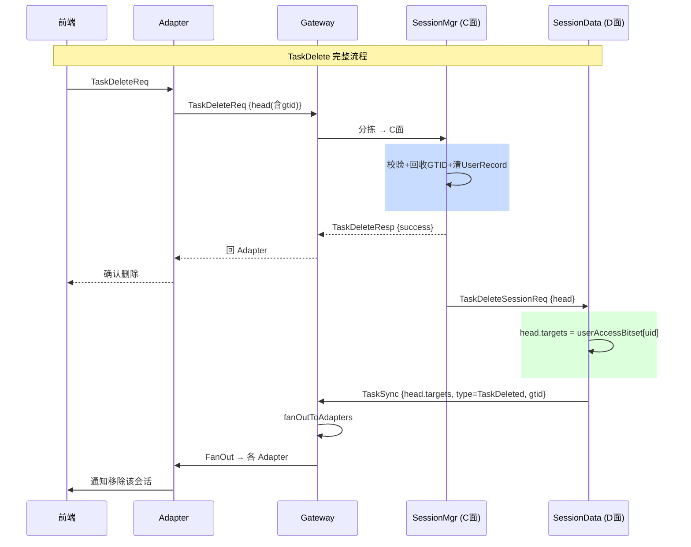

# ADR-0026：TaskSync 统一同步消息

| 状态 | 日期 | 决策者 |
|------|------|--------|
| 已采纳 | 2026-07-03 | — |

---

## 背景

SessionData 的 fan-out 机制（通过 `UserHead.targets`）是 D 面唯一的多端分发通道。多种 D 面事件需要通知所有 adapter：会话删除、上下文同步完成、未来可能的会话状态变更等。

为每种事件各定义一个新的 fan-out 消息类型会导致：(1) Gateway 和 Adapter 各需新增 handler；(2) 消息类型膨胀。需要一个统一的同步消息格式。

## 决策

### `TaskSync` 统一消息

```
TaskSync {
    UserHead head,           // uid + targets（fan-out 位图）
    TaskSyncType type,       // 事件类型
    GTID gtid                // 关联的 GTID
}
```

### `TaskSyncType` 枚举

| 值 | 含义 | 说明 |
|----|------|------|
| `TaskDeleted` | 会话已删除 | 前端从会话列表移除该 GTID |
| `ContextSynced` | 上下文同步完成 | 预留，当前未实现 |

### 流程



### 会话创建不需要同步

会话创建时，其他端通过重新登录获取 `UserLoginResp.gtids` 自然同步会话列表。不需要独立的 TaskSync 通知。

### 上下文同步复用

未来上下文同步完成后，发了也走 `TaskSync{type=ContextSynced}`。一条消息类型覆盖所有 D 面同步事件。

## 影响

- 新增枚举 `TaskSyncType`（`common/type/`）
- 新增消息：`TaskDeleteSessionReq`（Mgr→Data）、`TaskSync`（Data→Gateway→Adapter）
- SessionData 的删除会话处理改为组装 `TaskSync` 而非独立消息
- Adapter 一个 `handle(TaskSync)` 处理所有 D 面同步事件
