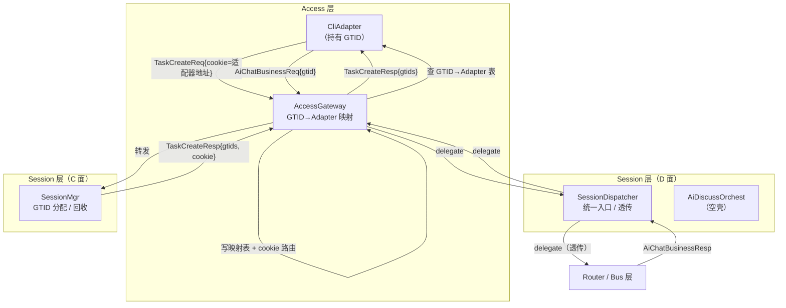

# -A：Session-D 面重构 & 用户系统清理

| 属性 | 值 |
|------|-----|
| Feature | FT0002 |
| Subfeature | -A |
| 状态 | 设计中 |
| 关联 ADR | ADR-0008（GTID）、ADR-0011（GTID 路由键） |
| 前置 | — |
| 后置 | -B（编排器契约）、-C（Web 前端） |

---

## 一、背景

Demo 阶段的架构规划与当前设计目标存在差异，以下为 Demo 时期引入、现已不再需要的过度设计：

1. **用户系统**（注册/登录/登出/注销）：为跨前端历史同步而建，维护 `userId` → `AppType` → `GTID` 的三级映射。远期的 userId 需求与当前实现目的完全不同，本 feature 中不认 user、只认前端，前端之间无记录同步。
2. **SessionData 多端同步**：维护 `userAccessBitset`（按 uid 索引的前端位图），在消息上行时做 fan-out 广播。跨前端同步职责应交由前端自行管理。

在 -H 已确立的 Session/Bus 三分类 GTID 体系下，Session 层需要独立的入口和路由能力。旧设计中 SessionData 仅做透明转发，无法支撑编排器按 `TaskType` 分发。

本 subfeature 完成两项工作：（1）清理上述过度设计；（2）建立 Session 层新框架——SessionDispatcher + AiDiscussOrchest 空壳。

---

## 二、架构变化

### 2.1 总览



### 2.2 C 面变化：SessionMgr 精简

**旧职责**：
- 用户注册/登录/登出/注销的生命周期管理
- `username` → `userId` 映射 + `userId` → `AppType` → `GTID` 三级结构
- 登录时通知 SessionData 做上下文同步

**新职责**：仅管理 GTID 生命周期。

| 接口 | 方向 | 行为 |
|------|------|------|
| `TaskCreateReq` | 入 | 原子分配 `requestNum` 个 GTID，创建 Context，返回 `TaskCreateResp{gtids, cookie}` |
| `TaskDeleteReq` | 入 | 回收 `gtids` 到 `TaskPool`，销毁 Context，无响应 |

不感知 frontend 身份、不做 type 校验、不通知任何 D 面 EO。

> 算法详见：[GTID 生命周期管理](../../alg/alg00001-gtid-lifecycle.md)

### 2.3 D 面变化：SessionData → SessionDispatcher

**删除**：`SessionData` 类及其全部逻辑（`userAccessBitset_`、fan-out 广播、上下文同步触发）。

**新建**：`SessionDispatcher` 作为 Session D 面统一入口。

在 -A 中，SessionDispatcher 为**纯透传**模式：

| 消息 | 行为 |
|------|------|
| `AiChatBusinessReq` | `delegateTo(routerAddr_)` |
| `AiChatBusinessResp` | `delegateTo(accessGatewayAddr_)` |

不维护任何映射表，不按 `TaskType` 分发。编排器分发逻辑在 -B 中建立。

### 2.4 AiDiscussOrchest 空壳

在 `DPlane/session/` 下新建 `AiDiscussOrchest` 类，仅包含 EO 框架代码（构造 + `init()` + `TempConfig` handler），不包含任何编排逻辑。在 -A 中**不接入消息路由**。


---

## 三、消息头重构

消息结构详见 [messages 文档](../../construct/messages.md)。

### 3.1 重构前后对比

| 字段 | 旧 | 新 | 原因 |
|------|----|----|------|
| `uid` | `uint16_t` | ❌ 删除 | 随用户系统一并移除 |
| `gtidList` | `vector<GTID>` | ♻️ 拆分 | 语义模糊：既表示"我是谁"也表示"发给谁" |
| `sessionTaskId` | — | ✅ `GTID` | Session 层 Task 的 GTID，标识消息来源，用于回程路由 |
| `busTaskIds` | — | ✅ `vector<GTID>` | 目标 BusTask GTID 列表，Router 据此 fan-out |
| `accessType` | `AccessType` | ❌ 删除 | 路由改用 GTID→Adapter 映射表 |
| `appType` | `AppType` | ❌ 删除 | 随用户系统移除，语义冗余 |
| `sessionFlags` | `SessionFlags` | ❌ 删除 | ACK 机制随跨端同步一并移除 |
| `targets` | `uint64_t` | ❌ 删除 | fan-out 位图随 userAccessBitset 移除 |

### 3.2 重构后结构

```
struct UserHead
    GTID sessionTaskId
    vector<GTID> busTaskIds
```

- `sessionTaskId`：标识消息来源（Session 层 Task），用于回程路由
- `busTaskIds`：目标 BusTask GTID 列表。单 AI 场景长度 = 1，多 AI 场景长度 > 1

### 3.3 Router fan-out 行为

Router 收到消息后遍历 `busTaskIds`，对每个 GTID：

1. **复制消息**，将副本的 `busTaskIds` **替换为仅含当前 GTID 的单元素列表**
2. 查路由表（`GTID >> 6`） → delegate 给对应 Bus EO

这样 Bus 层 EO 视角永远一致——`busTaskIds` 始终是单元素列表，直接 `busTaskIds.at(0)` 即知自己要处理哪个 Task。无论上游是 1 对 1 还是 fan-out。

---

## 四、关键设计决策

### 4.1 路由机制：GTID→Adapter 映射替代 AccessType 索引

**旧方案**：`AccessGateway` 通过 `adapterTable_[accessType]` 按前端类型索引 adapter。

**新方案**：`AccessGateway` 维护 `gtidToAdapter_`（`GTID → EoAddress` 映射表）：

| 时机 | 操作 |
|------|------|
| `TaskCreateReq` 经过 Gateway 时 | 将来源 Adapter 地址填入 `cookie` 字段，转发给 SessionMgr |
| `TaskCreateResp` 到达 Gateway 时 | 从 `cookie` 读取目标 Adapter，对 `gtids` 逐条写入映射表，转发给 Adapter |
| 业务响应（`AiChatBusinessResp`）到达时 | 查 `gtidToAdapter_[head.sessionTaskId]`，`delegateTo` 到对应 adapter |
| `TaskDeleteReq` 经过 Gateway 时 | 对 `gtids` 逐条删除映射表条目，转发给 SessionMgr |

**优势**：GTID 天然唯一，无需额外的前端类型枚举。后续多前端时，Gateway 在转发 `TaskCreateReq` 时记住来源 adapter 即可，无需 `AccessType` 概念。

> 算法详见：[GTID→Adapter 映射算法](../../alg/alg00002-gtid-adapter-mapping.md)

### 4.2 前端状态：GTID 即会话

删除用户系统后，前端身份仅由 GTID 定义。CliAdapter 内部两状态：

| 状态 | 行为 |
|------|------|
| `haveNotGtid` | 输入文本 → 缓存文本 → 发 `TaskCreateReq` → 收到 `TaskCreateResp{g}` → 发 `AiChatBusinessReq{g, 缓存文本}` → 切到 `hasGtid` |
| `hasGtid` | 输入文本 → 直接发 `AiChatBusinessReq{g, 文本}`；`/quit` → 发 `TaskDeleteReq{[g]}`（无响应）→ 切回 `haveNotGtid` |

提示符：`haveNotGtid` 显示 `> `，`hasGtid` 显示 `[0x<gtid>]> `。

### 4.3 Adapter 基类简化

`AccessAdapterBase` 移除 `AppType`、`AccessType` 模板参数，移除 `fillHead()`、`setUidInHead()`、`userToConn_`、`connToUser_`。SessionFlags 随 ACK 机制一并删除。

---

## 五、删除清单

### 5.1 概念级

| 概念 | 原因 |
|------|------|
| `uid`（userId + AppType 编码） | 随用户系统移除 |
| `AppType`（前端应用类型） | 为 user 概念服务，语义冗余于 AccessType |
| `AccessType`（前端连接方式） | 路由改为 GTID→Adapter 映射 |
| `SessionFlags`（会话标志位） | ACK 机制随跨端同步移除 |
| `TaskSync`（跨前端同步通知） | 跨端同步职责移交前端 |

### 5.2 消息类型

| 类别 | 消息 |
|------|------|
| 用户系统 | `UserRegisterReq/Resp`、`UserRegisterSessionReq`、`UserLoginReq/Resp`、`UserLoginSessionReq/Resp`、`UserLogoutReq/Resp`、`UserLogoutSessionReq/Resp`、`UserDeleteReq/Resp` |
| 跨端同步 | `TaskDeleteSessionReq`、`TaskSync` |
| ACK | `AiChatMsgAck` |
| 预留未用 | `SessionSetupSessionReq/Resp`、`SessionCloseSessionReq` |

### 5.3 EO 类

| 类 | 处理 |
|----|------|
| `SessionData` | 删除，由 `SessionDispatcher` 替代 |
| `AiDiscussOrchest` | 新建（空壳） |
| `SessionDispatcher` | 新建（透传） |

---

## 六、对后续 Subfeature 的影响

| 后续 | -A 提供的基础 |
|------|---------------|
| -B（编排器契约） | SessionDispatcher 框架 + AiDiscussOrchest 空壳，-B 直接填充路由表和编排逻辑 |
| -C（Web 前端） | 简化的 `AccessAdapterBase` + GTID→Adapter 映射表，新增 Web Adapter 只需继承基类 |
| -D（多 AI 辩论） | `busTaskIds` 字段预留，AiDiscussOrchest 已就位 |
| -G（Context 精简） | ACK 已删，减少一条清理项 |

---

## 七、算法索引

| 编号 | 算法 | 文档路径 |
|------|------|------|
| alg00001 | GTID 生命周期管理 | [alg00001-gtid-lifecycle.md](../../alg/alg00001-gtid-lifecycle.md) |
| alg00002 | GTID→Adapter 映射 | [alg00002-gtid-adapter-mapping.md](../../alg/alg00002-gtid-adapter-mapping.md) |

---


