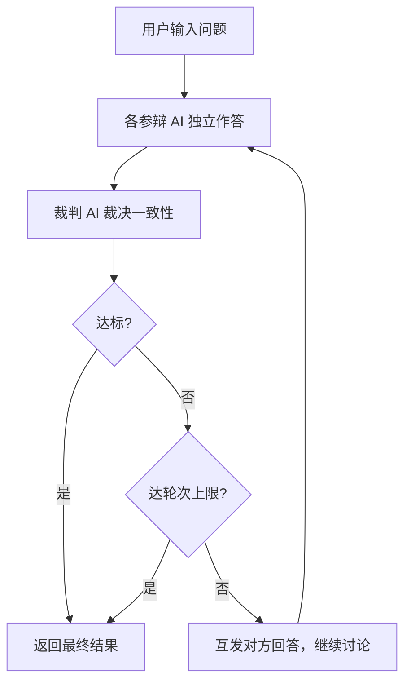
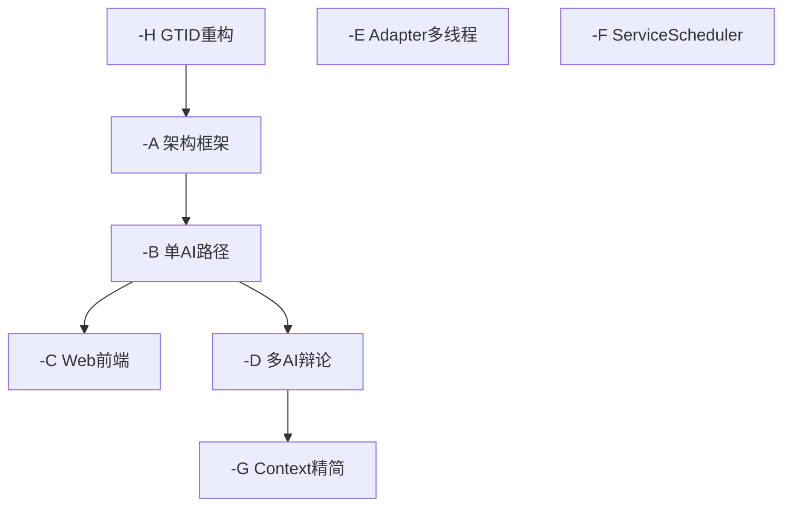

# FT0002：AI Agora — 多 AI 辩论

| 状态 | 日期 | 负责人 |
|------|------|--------|
| 设计中 | 2026-07-24 | 韵启龙 |

---

## 概述

用户通过前端配置多个不同角色提示词的 AI 代理人，FlowHub 协调它们就同一问题进行辩论式回答。
全部回答后由裁判 AI 裁决一致性：达标则返回结果，不达标则互发对方回答进入下一轮讨论，
直到一致性达标或达到轮次上限。



### 核心特性

- 可配置 N 个参辩 AI + 1 个裁判 AI（可退化到 1 个 AI = 单 AI Chat）
- 多轮辩论直到一致性达标或达轮次上限
- Web 前端配置提示词、API Key，可视化辩论过程
- Session 层新增编排器 EO，统一三层对称入口架构

---

## Subfeature 总览

| 阶段 | 文档 | 内容 | 可测试行为 |
|------|------|------|-----------|
| **-H** | -H-gtid-restructure.md | GTID 重构：System/Session/Bus 三分类，统一 TaskType | 三分类体系可用，SessionDispatcher 和 Router 按 Category 路由 |
| **-A** | -A-session-dplane-restructure.md | 架构框架：SessionDispatcher + AiDiscussOrchest + SessionMgr 精简 | 现有 AiChat 无回归，走新架构链路 |
| **-B** | -B-single-ai-path.md | 单 AI 对话走编排器路径 | 编排器路径完成单 AI 问答，等效现有 AiChat |
| **-C** | -C-web-frontend.md | Web 前端替代 CLI | Web 页面配置 AI、提问、查看回复 |
| **-D** | -D-multi-ai-debate.md | 多 AI 辩论 + 裁判流程 | 多轮辩论 → 裁判裁决 → 全流程跑通 |
| **-E** | -E-adapter-multithreading.md | AiApiAdapter 多线程支持 | 并发子任务不互相阻塞 |
| **-F** | -F-service-scheduler.md | ServiceGateway→ServiceScheduler，round-robin | 多 adapter 均匀分配请求 |
| **-G** | -G-context-slim-down.md | Context 精简：历史前移 | Context 大小恒定，不随轮次增长 |

### 依赖关系



- -H 定义 GTID 分类与枚举，-A 依赖它进行 Session/Bus 分层路由。
- -B 依赖 -A；-C 和 -D 都依赖 -B，但 -C 与 -D 彼此平行。
- -E、-F 独立，不依赖其他 subfeature，也不被其他依赖。
- -G 依赖 -D（全流程跑通后再优化 Context）。

---

## 架构概述

```
AccessGateway          ← Access 层入口（不变）
    │
SessionDispatcher      ← Session 层 D 面入口，按 Session Category (0x7) 路由
    │
    └──→ AiDiscussOrchest ──→ Router ──→ AiChatBus(s)   ← 按 Bus Category (0x9) 路由
                                      │
                                 ServiceScheduler ← Service 层入口
                                   ├── AiApiAdapter-0
                                   └── ...
```

GTID 按 Category 分层路由，统一 `TaskType` 枚举：
- **Session** (0x7)：SessionDispatcher 路由到编排器
- **Bus** (0x9)：Router 路由到 AiChatBus
- 两层使用相同的路由表模式（`TaskType → EoAddress`）

核心变更：Session 层新增编排器 EO，GTID 按分类分层路由。子对话复用 AiChatBus，通过 Router 间接调用。各层细节见对应 subfeature 文档。
