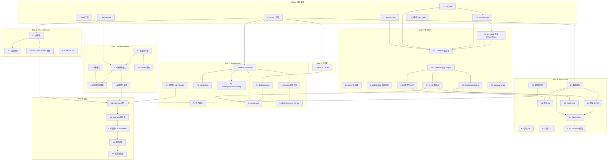

# 实现路线图 — Session 层 + Access 层

> 基准文档：`docs/access-session-design-checklist.md` Round 1~9（全部已确认）
> 创建时间：2026-07-02
> 关联差距分析：见阶段 B 差距分析报告（内联于路线图制定对话中）

---

## 路线总览

```
Step 1   基础类型      →  AccessType / AppType / ErrorCode 枚举、MAX_* 常量、SessionFlags 类、uid 工具 ✅
Step 2   消息定义      →  脚本适配、UserHead 重构、文档修订、C 面消息（×4 组）、C→D 通知（×3）、DeleteSession
Step 3   工具类        →  BatchCounter 封装 ✅
Step 4   AccessAdapter  →  scoped_actor、userToConn_/connToUser_、编译期常量、消息头填入、fan-out 处理
Step 5   AccessGateway  →  新建 Gateway EO、adapterTable_、消息分拣、fanOutToAdapters 模板
Step 6   SessionMgr    →  usernameToId_、UserRecord、uidBitset、注册/登录/登出/注销、TaskCreate/Delete、CLI Demo 交互 ✅
Step 7   SessionData   →  userAccessBitset、透传模式、C→D 通知、上行 targets 填入 ✅（上下文同步 demo 跳过）
Step 8   集成与清理    →  更新 main.cpp 接线、适配 Business 层、清理 sourceAddress ✅、端到端验证 ✅
Step 9   单元测试      →  覆盖核心路径和边界
Step 10  系统组装      →  main 函数结构、组件实例化位置、消息驱动 setup 流程、替换 TempConfig 临时方案
```

---

## 详细 Checklist

### Step 1 — 基础类型与常量定义

- [x] **1.1 创建 `AccessType` 枚举**
  - 文档出处：checklist Round 1 §1.1
  - 文件：`src/common/type/AccessType.mt`（新建）→ `src/generated/type/AccessType.hpp`
  - 内容：`enum class AccessType : uint8_t { AiChatCLI = 0, AiDiscussionCLI = 1 }`
  - 完成标准：编译通过，生成文件正确
  - 依赖：无

- [x] **1.2 创建 `AppType` 枚举**
  - 文档出处：checklist Round 1 §1.1
  - 文件：`src/common/type/AppType.mt`（新建）→ `src/generated/type/AppType.hpp`
  - 内容：`enum class AppType : uint8_t { AiChat = 0, AiDiscussion = 1 }`
  - 完成标准：编译通过，生成文件正确
  - 依赖：无

- [x] **1.3 创建 `ErrorCode` 枚举**
  - 文档出处：checklist Round 9 §9.3
  - 文件：`src/common/type/ErrorCode.mt`（新建）→ `src/generated/type/ErrorCode.hpp`
  - 内容：`None`（无错误默认值）、`InvalidGtid`、`TaskTypeNotAllowed`、`NoGtidNewTask`、`Timeout`、`InternalError`、`OtherError`（兜底）
  - 完成标准：编译通过
  - 依赖：无

- [x] **1.4 定义 `MAX_*` 常量**
  - 文档出处：checklist Round 2 §2.1、Round 9 §9.4
  - 文件：`src/common/Constants.hpp`（新建）
  - 内容：`kMaxUsers=64`、`kMaxAppTypes=64`、`kMaxAccessTypes=64`、`kMaxUid=65536`、`kMaxClientsPerAccess=64`、`kMaxGtidsPerUser=128`、`kMaxBatchCounterNum=16`
  - 完成标准：编译通过
  - 依赖：无

- [x] **1.5 创建 `SessionFlags` 类**
  - 文档出处：checklist Round 9 §9.1、ADR-0021
  - 文件：`src/common/SessionFlags.hpp`（新建）
  - 内容：`BitFlags` 内部枚举 + `constexpr` 默认构造 + `static constexpr make<AppType>()` 工厂 + `isNeedAck()` 查询 + 私有值构造函数
  - `AiChat` 和 `AiDiscussion` 均设 `needAckBit`
  - 完成标准：编译通过
  - 依赖：1.2（需要 `AppType`）

- [x] **1.6 创建 `uid` 编解码工具**
  - 文档出处：checklist Round 1 §1.5
  - 文件：`src/common/UidUtil.hpp`（新建）
  - 内容：`makeUid(userId, AppType) → uint16_t`、`getUserId(uid) → uint8_t`、`getAppType(uid) → AppType`
  - 完成标准：编译通过
  - 依赖：1.2（AppType）、1.4（Constants）

- [x] **1.7 注册枚举到类型系统并重新生成**
  - `gen_code.py` 自动扫描 `common/type/*.mt`，已正确发现并生成 `AccessType.hpp`、`AppType.hpp`、`ErrorCode.hpp`
  - 无需额外手动注册
  - 依赖：1.1, 1.2, 1.3

---

### Step 2 — 消息定义

- [x] **2.1 `gen_code.py` 适配 — 非 `.mt` include 自动注册类型**
  - 新增规则：`include` 路径不以 `.mt` 结尾 → 自动提取类型名、推断命名空间、注册到 `TYPE_MAP`
  - 示例：`include common/SessionFlags.hpp` → 自动注册 `SessionFlags` → `common::SessionFlags`
  - 完成标准：`UserHead.mt` 中使用 `SessionFlags sessionFlags` 字段能正确生成
  - 依赖：1.5

- [x] **2.2 废弃 `UserInfo` 结构体**
  - 文档出处：`UserInfo` 的三字段已被后续设计决策逐一替代——`clientId` 砍掉（Round 1 §1.6）、`userId` 编码进 `uid`（Round 1 §1.5）、`accessType` 提升为 `UserHead` 直接字段（Round 9 §9.5）
  - 操作：删除 `src/common/message/UserInfo.mt`，ADR-0020 追加修订记录说明废弃原因
  - 完成标准：生成系统中不再出现 `UserInfo`
  - 依赖：2.3（UserHead 已扁平化）

- [x] **2.3 更新 `UserHead` — 替换 `sourceAddress` 为文档定义的五字段**
  - 文档出处：checklist Round 9 §9.5、ADR-0024
  - 文件：`src/common/message/UserHead.mt`（修改）→ 重新生成 `src/generated/message/UserHead.hpp`
  - 变更：
    - **删除** `EoAddress sourceAddress`、`UserInfo userInfo`
    - **新增** `uint16 uid`、`AccessType accessType`、`AppType appType`、`SessionFlags sessionFlags`
    - **新增** `include common/SessionFlags.hpp`（通过 2.1 的脚本规则自动解析）
  - 完成标准：生成代码字段正确，`SessionFlags` include 由 `field_includes` 自动添加
  - 依赖：1.1、1.2、1.5、2.1

- [x] **2.4 文档修订：ADR-0022 fan-out 方案简化**
  - 原方案：BatchFanOut（SessionData→Gateway）+ FanOutMsg（Gateway→Adapter）两级消息
  - 新方案：`UserHead` 增加 `uint64 targets` 字段（0 = 不 fan-out），SessionData 填入位图后原消息直传，Gateway 遍历 targets 逐个转发，**零新消息类型**
  - 修订内容：在 ADR-0022 末尾追加修订记录，说明简化原因（两级消息类型冗余、CAF 不支持模板化消息、targets 放在 UserHead 语义合理）
  - 完成标准：ADR-0022 修订记录完整
  - 依赖：无（纯文档）

- [x] **2.5 更新 `UserHead` — 追加 `targets` 字段**
  - 文件：`src/common/message/UserHead.mt`（修改）
  - 变更：新增 `uint64 targets` 字段
  - 语义：`0` = 普通消息不 fan-out；`!= 0` = fan-out 位图（每位对应一个 AccessType）
  - 填入者：SessionData（从 `userAccessBitset[uid]` 拷贝）；读取者：Gateway（遍历分发）、Adapter（不需读——收到时已清零）
  - 完成标准：生成代码正确
  - 依赖：2.4（文档先行）

### Step 2 — 消息定义（续）

- [x] **2.6 C 面请求/响应消息**
  - 文档出处：checklist Round 7 §7.1~7.5
  - **注意**：`appType` + `accessType` 由 Adapter 编译期填入 `UserHead`，不在消息体中重复。
  - 依赖：2.5（UserHead）

  - [x] **2.6.1 `UserRegisterReq` / `UserRegisterResp`**
    - `UserRegisterReq.mt`：`UserHead head` + `string username` + `uint8 connectionId`
    - `UserRegisterResp.mt`：`UserHead head` + `string username` + `uint8 connectionId` + `bool success`
    - `connectionId` 由 Adapter 分配，用于匹配响应到对应连接
    - `head.uid` 由 SessionMgr 在响应中填入；`success=false` 时 `head.uid` 保持 `kInvalidUid`

  - [x] **2.6.2 `UserLoginReq` / `UserLoginResp`**
    - `UserLoginReq.mt`：`UserHead head` + `string username` + `uint8 connectionId`
    - `UserLoginResp.mt`：... + `bool needWaitForData` + `vector<GTID> gtids`
    - `needWaitForData`：SessionMgr → SessionData → 回 `{needsSync}` → 据此填入；通用字段，告知前端是否需等待 D 面数据就绪
    - SessionMgr 通过 `usernameToId_` 查 userId
    - `connectionId` 用于 Adapter 在登录完成前匹配响应到连接

  - [x] **2.6.3 `UserLogoutReq` / `UserLogoutResp`**
    - `UserLogoutReq.mt`：`UserHead head`
    - `UserLogoutResp.mt`：`UserHead head` + `bool success`
    - `userId` 隐含在 `head.uid` 中，无需重复携带
    - 回程时 `userToConn_` 仍有效，故 Req 无需 `connectionId`；收到 Resp 后才清表

  - [x] **2.6.4 `UserDeleteReq` / `UserDeleteResp`**
    - `UserDeleteReq.mt`：`UserHead head`
    - `UserDeleteResp.mt`：`UserHead head` + `bool success`
    - SessionMgr 从 `head.uid` 提取 `userId` + `appType`，查 `UserRecord[userId][appType].name` 得 username

- [x] **2.7 C→D 通知消息**
  - 文档出处：checklist Round 3 §3.2
  - 方向：SessionMgr ↔ SessionData，不经过 Gateway，不到 Adapter
  - 依赖：2.5（UserHead）

  - [x] **2.7.1 `UserLoginSessionReq` / `UserLoginSessionResp`**
    - `UserLoginSessionReq.mt`：`UserHead head` + `vector<GTID> gtids`
    - `UserLoginSessionResp.mt`：`UserHead head` + `bool needWaitForData`
    - SessionMgr 在登录校验通过后发 Req → SessionData 瞬间回复 Resp（O(1) 判断是否需上下文同步）
    - SessionMgr 将 `needWaitForData` 填入 `UserLoginResp.needWaitForData`

  - [x] **2.7.2 `UserLogoutSessionReq` / `UserLogoutSessionResp`**
    - `UserLogoutSessionReq.mt`：`UserHead head`
    - `UserLogoutSessionResp.mt`：`UserHead head` + `uint8 activeAdapterCount`
    - `activeAdapterCount = 0` 时 SessionMgr 将来可触发持久化 SystemTask（当前预留）
  - [x] **2.7.3 `UserRegisterSessionReq`**
    - `UserRegisterSessionReq.mt`：`UserHead head` + `uint8 userId`
    - SessionMgr 发 `UserRegisterResp` 的同时发此消息给 SessionData，清零该 `userId` 下所有 AppType 的 `userAccessBitset`
    - `head.uid` 可为空；遍历以 `userId` 为单位，按 `makeUid(userId, appType)` 逐 AppType 清零
    - 无 Resp（fire-and-forget）

  - [x] **2.7.4 `TaskDeleteSessionReq` + `TaskSync`**
    - `TaskDeleteSessionReq.mt`：`UserHead head`（gtidList 含被删 GTID）
    - `TaskSync.mt`：`UserHead head` + `TaskSyncType type` + `GTID gtid`
    - 统一 D 面同步消息，`type` 区分事件类型（TaskDeleted / ContextSynced 预留）
    - SessionMgr 回收 GTID 后 → 发 `TaskDeleteSessionReq` → SessionData 填 targets → 发 `TaskSync` fan-out
    - ADR-0026

- [x] **2.8 Task 生命周期消息**
  - 文档出处：ADR-0023（修订后）
  - 依赖：2.5（UserHead）

  - [x] **2.8.1 `TaskCreateReq` / `TaskCreateResp`**
    - `TaskCreateReq.mt`：`UserHead head`（gtidList 为空）+ `TaskType taskType`
    - `TaskCreateResp.mt`：`UserHead head`（gtidList 含正式 GTID）+ `bool success`
    - 登录后使用，无需 connectionId（uid 有效 → userToConn_ 已建）

  - [x] **2.8.2 `TaskDeleteReq` / `TaskDeleteResp`**
    - `TaskDeleteReq.mt`：`UserHead head`（gtidList 含要删的 GTID）
    - `TaskDeleteResp.mt`：`UserHead head` + `bool success`
    - 纯 C 面，SessionMgr 回收资源后回复；D 面同步走 2.7.4

- [x] **2.9 更新 `Messages.hpp` 注册表**
  - `gen_code.py` 自动扫描所有 `.mt` 文件并注册，无需手动维护
  - 当前 32 个消息类型已全部注册

- [ ] **2.10 `gen_code.py` 支持 `optional` 字段语法** 🚫 已搁置
  - 记录于 `docs/doc-debt.md`「当前实现待办」

---

### Step 3 — 工具类

- [x] **3.1 创建 `BatchCounter` 类**
  - 文件：`src/common/BatchCounter.hpp` + `.cpp`
  - `allocate(total) → BatchToken{index, epoch}`：epoch 校验防止 GC 后误扣
  - `onReply(token)`：校验 `counter[index].epoch == token.epoch` 后才扣减
  - `isComplete(index)` / `isActive(index)` / `isTimeout(index)` (private)
  - 分配时遍历 GC 超时 counter（5 秒阈值）
  - 内容：
    - `allocate(uint8_t total) → uint8_t index`：分配 counter，返回 `batchCounterResources_` 下标
    - `onReply(uint8_t index)`：计数 -1
    - `isComplete(uint8_t index) → bool`
    - `isTimeout(uint8_t index) → bool`：供分配时 GC 检查（阈值 5 秒）
    - 内部数组 `std::array<Counter, kMaxBatchCounterNum>`
    - 分配时 GC：遍历已占用 counter，超过阈值则强制释放
  - 完成标准：编译通过
  - 依赖：1.4（`kMaxBatchCounterNum`）

---

### Step 5 — AccessGateway

> **注意**：此 Gateway 是 Access 层的 Gateway（Adapter ↔ Session 层之间），不是现有的 `ServiceGateway`（Business ↔ Service 层之间）。两者是不同的 EO。

- [x] **5.1 创建 `AccessGateway` 类**
  - 文档出处：checklist Round 2 §2.5、Round 4 §4.2（Gateway）、Round 6 §6.3.2
  - 文件：`src/access/AccessGateway.hpp` + `src/access/AccessGateway.cpp`（新建）
  - 成员：
    - `std::array<fw::EoAddress, kMaxAccessTypes> adapterTable_` — AccessType → Adapter 地址
    - `fw::EoAddress sessionMgrAddr_` — SessionMgr 地址（控制面消息目标）
    - `fw::EoAddress sessionDataAddr_` — SessionData 地址（数据面消息目标）
  - 完成标准：编译通过
  - 依赖：1.4（常量）、1.1（AccessType）

- [x] **5.2 实现消息分拣逻辑**
  - 文档出处：checklist Round 4 §4.2（Gateway）
  - **分拣策略：纯按消息类型**，不检查 GTID 内容
  - 处理的消息类型与分拣规则：
    | 消息 | 路由目标 |
    |------|---------|
    | `UserRegisterReq` / `UserLoginReq` / `UserLogoutReq` / `UserDeleteReq` | `sessionMgrAddr_`（控制面） |
    | `TaskCreateReq` / `TaskDeleteReq` | `sessionMgrAddr_`（控制面） |
    | `AiChatBusinessReq` | `sessionDataAddr_`（数据面） |
    | `AiChatBusinessResp` / `AiChatMsgAck` / `TaskSync` | fan-out 转发到各 Adapter |
  - 注：原 ADR-0023 哨兵 GTID 方案已废弃，改为 `TaskCreateReq`/`TaskDeleteReq` 独立消息协议
  - 完成标准：编译通过，分拣逻辑与文档一致
  - 依赖：2.6~2.8（消息类型）

- [x] **5.3 实现 fan-out 转发（`fanOutToAdapters` 模板）**
  - 文档出处：checklist Round 6 §6.3.2、ADR-0022（修订后）
  - 私有模板 `template <typename Msg> void fanOutToAdapters(Msg& msg)`：
    1. 读 `msg.head.targets`
    2. 若 `targets == 0`：`delegateTo(adapterTable_[head.accessType], std::move(msg))`
    3. 若 `targets != 0`：遍历置位 bit，`sendTo(adapterTable_[i], Msg{msg})` 逐拷贝转发
  - Adapter 不读 `targets`，无需清零
  - 完成标准：编译通过
  - 依赖：5.1

- [x] **5.4 更新 `CMakeLists.txt`**
  - 文件：`src/access/CMakeLists.txt`（修改）
  - 将 `AccessGateway.cpp` 加入编译
  - 依赖：5.1

---

### Step 6 — SessionMgr 规范实现

> 当前 `SessionMgr` 仅有 GTID 分配/回收功能。需按文档完整实现控制面生命周期。

- [x] **6.1 实现内部数据结构**
  - 文档出处：checklist Round 2 §2.3
  - 文件：`src/DPlane/session/SessionMgr.hpp`（修改）
  - 新增成员：
    - `std::unordered_map<std::string, uint8_t> usernameToId_` — username → userId
    - `UserRecord` 结构体（含 `char name[32]`（从 usernameToId_ 反查，用于日志）+ `static_vector<GTID, kMaxGtidsPerUser>`）
    - `std::array<std::array<UserRecord, kMaxAppTypes>, kMaxUsers> userRecords_` — 64×64 二维表
    - `std::bitset<kMaxUsers> uidBitset_` — userId 分配位图
    - `constexpr` 编译期常量：AppType → TaskType 集合映射（用于闸门校验）
  - 完成标准：编译通过
  - 依赖：1.4（常量）、1.2（AppType）、1.1（AccessType）

- [x] **6.2 实现注册（D0）**
  - 文档出处：checklist Round 7 §7.1（已修订：username 是 userId 级别，注册不绑定 appType）
  - 处理 `UserRegisterReq{username}`：
    1. 检查 username 是否已在 `usernameToId_` 中
    2. 从 `uidBitset_` 分配空闲 userId
    3. `usernameToId_[username] = userId`
    4. 返回 `UserRegisterResp{uid = makeUid(userId, head.appType)}`
  - 注：注册只建立 username↔userId 映射，不初始化 UserRecord。各 appType 的 UserRecord 在首次登录时 lazy 初始化。

- [x] **6.3 实现登录（D1/D2）**
  - 文档出处：checklist Round 7 §7.2~7.3（已修订：登录只校验 usernameToId_，不校验 UserRecord 是否初始化）
  - 处理 `UserLoginReq{username}`（从 `UserHead` 读取 `appType`、`accessType`）：
    1. 查 `usernameToId_` 获取 userId → 未注册则 fail
    2. 若 `UserRecord[userId][appType]` 尚未初始化，视为空 GTID 列表（首次用该 appType 登录）
    3. 否则取出 GTID 列表
    4. 向 SessionData 发 `UserLoginSessionReq{uid, gtids}`
    5. 等待 SessionData 回复 `UserLoginSessionResp{needWaitForData}`
    6. 返回 `UserLoginResp{uid, gtids, needWaitForData}` 经 Gateway 回 Adapter
  - **D1 vs D2 区分**：首次登录 gtids 为空（不触发上下文同步），后续登录 gtids 非空。区分逻辑在 SessionData 侧。

- [x] **6.4 实现登出（D6）**
  - 文档出处：checklist Round 7 §7.4
  - 处理 `UserLogoutReq`（从 `head.uid` 提取 `userId`，从 `head` 读取 `accessType`）：
    1. 向 SessionData 发 `UserLogout{uid, accessType}`
    2. 等待 SessionData 回复（含活跃 adapter 数）
    3. 返回 `LogoutResp` 给前端
  - 完成标准：编译通过
  - 依赖：6.1、2.6.3、2.7

- [x] **6.5 实现注销（D7）**
  - 文档出处：checklist Round 7 §7.5
  - 处理 `UserDeleteReq`（从 `head.uid` 提取 `userId`、`appType`）：
    1. 遍历 `UserRecord[userId][appType]` 中所有 GTID，逐一 `pool_.deallocate()`
    2. 清空 `UserRecord[userId][appType]`
    3. 从 `usernameToId_` 移除
    4. 释放 `userId`（清 `uidBitset_` 对应位）
    5. 返回 `DeleteResp`
  - 完成标准：编译通过
  - 依赖：6.1、2.6.4

- [x] ~~**6.6 实现 `UserReset` 发送**~~ → 已并入 6.2
  - 注册成功后直接发 `UserRegisterSessionReq` 给 SessionData 清零该 userId 所有 appType 的 bitset，无需独立的 UserReset 机制

- [x] **6.7 实现 TaskCreate 处理**
  - 文档出处：ADR-0023（修订后）
  - 处理 `TaskCreateReq`：
    1. 闸门校验：该 `appType` 是否包含请求的 `taskType`
    2. 分配正式 GTID（`pool_.allocate(taskType)`）
    3. 写入 `UserRecord[userId][appType]`
    4. 返回 `TaskCreateResp{success, gtid}`
  - 不再需要"连同原始数据转发"——数据消息前端拿到 GTID 后单独发送
  - 依赖：6.1

- [x] **6.8 实现 TaskDelete 处理**
  - 文档出处：ADR-0023（修订后）
  - 处理 `TaskDeleteReq`：
    1. 校验 `gtid` 属于该 (userId, appType)
    2. 从 GTID 池回收，从 `UserRecord` 移除
    3. 通知 SessionData（fan-out 给各 Adapter）
    4. 返回 `TaskDeleteResp{success}`
  - 依赖：6.1、2.8.2

- [x] **6.9 移除旧的 `SessionSetupSessionReq` / `SessionCloseSessionReq` 处理**
  - 旧 `SessionSetupSessionReq` → 被 `TaskCreateReq` 替代（6.7）
  - 旧 `SessionCloseSessionReq` → 被 `TaskDeleteReq` 替代（6.8）
  - 从 `init()` 中移除对应 `onMsg`，删除旧 handler
  - ⚠️ 依赖 6.1~6.8 先完成（新 handler 实现后旧 handler 才能删，否则临时 main.cpp 无法编译）
  - 依赖：6.7、6.8

- [x] **6.10 CLI Demo 交互流程**
  - 路径：显式 `/register <name>` → `/login <name>` → 登录后自动 `TaskCreate` → 用户输入文本进入对话
  - 注册：建立 username↔userId 映射（userId 级别，不绑定 appType）
  - 登录：校验 userId → 向 SessionData 发 `UserLoginSessionReq` → 成功后自动发送 `TaskCreateReq` 建 Task
  - 两个行为（登录响应 + Task 创建响应）串行完成后才释放输入锁，允许用户继续操作
  - `/new` 命令：已登录时可用，新建 Task 并切换当前 GTID
  - `/help` 按当前状态标注可用命令（未登录标 `/register` `/login` `/delete`，已登录标 `/logout` `/new`）
  - 依赖：6.2、6.3、6.7

---

### Step 7 — SessionData 规范实现

> 当前 `SessionData` 仅做简单转发 + `sourceAddress` 回传。需完整实现文档定义的透传模式、C→D 通知处理、fan-out 机制。

- [x] **7.1 实现 `userAccessBitset`**
  - 文档出处：checklist Round 2 §2.4
  - 文件：`src/DPlane/session/SessionData.hpp`（修改）
  - 新增成员：`std::array<uint64_t, kMaxUid> userAccessBitset_` — 65536 × 8 字节 = 512 KB
  - 辅助方法：`setBit(uid, accessType)`、`clearBit(uid, accessType)`、`getTargets(uid) → uint64_t`
  - 完成标准：编译通过
  - 依赖：1.4（`kMaxUid`）、1.1（AccessType）

- [ ] **7.2 实现 `batchCounterResources_`**（demo 阶段跳过）
  - 文档出处：checklist Round 2 §2.4、Round 9 §9.2
  - 新增成员：`BatchCounter batchCounter_`（封装 `std::array<Counter, kMaxBatchCounterNum>`）
  - 用途：上下文同步（7.4）、批量 fan-out 消息计数
  - 当前单 Adapter demo 无需此机制，待多 Adapter 场景时实现

- [x] **7.3 实现透传模式**
  - 文档出处：checklist Round 3 §3.1、Round 4 §4.2（SessionData）
  - 收到带正式 GTID 的数据面请求（如 `AiChatBusinessReq`）→ 按值接收 + `std::move` 零拷贝转发至 Router
  - **不查** `userAccessBitset`，**不做** fan-out
  - 完成标准：编译通过
  - 依赖：7.1

- [x] **7.4 实现 `UserLogin` 处理**（基础部分）
  - 文档出处：checklist Round 3 §3.2、Round 7 §7.2.3
  - `setBit(uid, accessType)` + 回复 SessionMgr（`needWaitForData=false`）
  - 上下文同步（gtids 非空 → batch counter → 批量消息 → Router）依赖 7.2，demo 阶段跳过
  - 依赖：7.1

- [x] **7.5 实现 `UserLogout` 处理**
  - 文档出处：checklist Round 3 §3.2、Round 7 §7.4.3
  - `clearBit(uid, accessType)` + `countActiveAdapters` + 回复 SessionMgr
  - 完成标准：编译通过
  - 依赖：7.1

- [x] **7.6 实现 `UserRegisterSessionReq` 处理**（原 UserReset）
  - 文档出处：checklist Round 3 §3.2
  - 逻辑：收到 `UserRegisterSessionReq{head, userId}` → 遍历所有 appType，清零 `userAccessBitset_[makeUid(userId, appType)]`
  - 无需回复（fire-and-forget）
  - 注：原独立 UserReset 消息已废弃，改为注册时顺带发送

- [x] **7.7 实现上行消息 fan-out（`targets` 填入）**
  - 文档出处：checklist Round 5 §5.2~5.3
  - `AiChatBusinessResp` 和 `AiChatMsgAck` 转发前：`msg.head.targets = userAccessBitset_[uid]`
  - `TaskDeleteSessionReq` 同样填 targets → `TaskSync` 发往 Gateway
  - Gateway 根据 targets 做 fan-out（当前单 Adapter 时 targets 仅含一位，等价直发）
  - 完成标准：编译通过
  - 依赖：7.1

- [x] **7.8 实现 `DeleteSession` fan-out 处理**
  - 文档出处：checklist Round 8 §8.2.3
  - `TaskDeleteSessionReq` handler 填 `head.targets` → 发 `TaskSync` 给 Gateway → Gateway 做 fan-out
  - 完成标准：编译通过
  - 依赖：7.7

- [x] **7.9 移除旧的 `replyToAddr_` 逻辑**
  - 当前代码已无 `replyToAddr_`，上行路径统一经 SessionData → Gateway → Adapter
  - 依赖：6.7

---

### Step 4 — AccessAdapter

> 当前 `CliAdapter` 用 `sessionActive_`/`sessionPending_`/`gtid_` 布尔量 + `pendingMessages_` 缓存队列。需替换为文档定义的 `userToConn_`/`connToUser_` 表 + 消息头填入 + 上行消息 fan-out 处理。

- [x] **4.1 实现通用 `AccessAdapter` 模板类**
  - 文档出处：checklist Round 2 §2.2
  - 文件：`src/access/AccessAdapter.hpp`（新建）
  - 模板参数：`<common::AppType kApp, common::AccessType kAcc>`
  - 基于 `caf::scoped_actor`（非 EO），外部线程运行；既能收 CAF 消息也能收外部 IO
  - 成员：`receiver_`(scoped_actor)、`userToConn_`、`connToUser_`、编译期常量 `kAppType`/`kAccessType`/`kSessionFlags`
  - 方法：消息头填入、fan-out 接收处理、连接生命周期管理、向 Gateway 注册
  - 依赖：1.x、2.x

- [x] **4.2 基于 `AccessAdapter` 实现 `CliAdapter`**
  - 文件：`src/access/CliAdapter.hpp` + `.cpp`（删除旧的，重新写）
  - 继承自 `AccessAdapter<AppType::AiChat, AccessType::AiChatCLI>`
  - CLI 特有逻辑：`stdin`/`stdout` 单连接（connectionId 恒为 0）、主循环阻塞读取用户输入
  - 处理流程：注册 → 登录 → 建 Task → 发送消息 → 收回复/ACK → 登出/注销
  - 覆盖虚方法：`onExternalInput()`（stdin 读取）、`onCafMessage()`（消息分发）、`sendToFrontend()`（stdout 输出）
  - 完成标准：编译通过，重构后的 CliAdapter 不再包含任何旧临时代码
  - 依赖：4.1

---

### Step 8 — 集成与清理

- [x] **8.1 更新 `main.cpp` 接线**（TempConfig 阶段）
  - 文件：`src/main.cpp`（修改）
  - 地址注入通过 TempConfig 消息交换完成（正式消息驱动 Setup 见 Step 10）：
    | EO | 获得地址 | 方式 |
    |----|---------|------|
    | AccessGateway | sessionMgr, sessionData | 对方构造时发 `TempConfig{1}`/`{2}` |
    | SessionMgr | sessionData | 构造函数参数 |
    | SessionData | gateway | 构造函数参数 |
    | CliAdapter | gateway | AccessGateway 构造时发 `TempConfig{0}` |
    | AiChatBus | sessionData | 构造函数参数 |
  - 已删除 `SessionSetupSessionReq`（6.9）
  - 完成标准：编译通过 ✅
  - 依赖：5.1、6.1、7.1、4.1

- [x] **8.2 适配 Business 层（最小修改）**
  - 文档出处：ADR-0024（移除 `sourceAddress`）
  - AiChatBus 已有 `sessionDataAddr_`，ACK/回复经 SessionData 上行 ✅
  - `sourceAddress` 已移除 ✅
  - `sessionFlags.isNeedAck()` 当前无条件发 ACK，按需后续细化 ⚠️
  - 完成标准：编译通过 ✅

- [x] **8.3 移除 `sourceAddress` 残留引用** ✅

- [x] **8.4 验证全量编译** ✅

- [x] **8.5 端到端 AiChat 功能验证** ✅
  - 完整链路验证通过：注册 → 登录 → 建 Task → 对话 → AI 回复 → 显示

---

### Step 9 — 单元测试

- [ ] **9.1 `SessionFlags` 单元测试**
  - 文件：`src/common/ut/SessionFlagsTest.cpp`（新建）
  - 覆盖：`make<AiChat>()` 返回正确的 needAckBit、默认构造 flags_==0、`isNeedAck()` 正确
  - 依赖：1.5

- [ ] **9.2 `BatchCounter` 单元测试**
  - 文件：`src/common/ut/BatchCounterTest.cpp`（新建）
  - 覆盖：allocate/onReply/isComplete 正常流程、分配时 GC 回收超时 counter、边界（满容量分配）
  - 依赖：3.1

- [ ] **9.3 `AccessGateway` 单元测试**
  - 文件：`src/access/ut/AccessGatewayTest.cpp`（新建）
  - 覆盖：Adapter 注册/查表、消息分拣（控制/数据/fan-out）、fanOutToAdapters 模板转发
  - 依赖：5.1~5.3

- [ ] **9.4 `SessionMgr` 单元测试**
  - 文件：`src/DPlane/session/ut/SessionMgrTest.cpp`（新建或扩展现有）
  - 覆盖：注册/登录/登出/注销完整流程、闸门校验、TaskCreate/TaskDelete 生命周期、userId 复用
  - 依赖：6.1~6.8

- [ ] **9.5 `SessionData` 单元测试**
  - 文件：`src/DPlane/session/ut/SessionDataTest.cpp`（新建或扩展现有）
  - 覆盖：bitset 置位/清位/查询、透传模式、UserLogin/Logout/Reset 处理、targets 填入转发、上下文同步触发
  - 依赖：7.1~7.8

- [ ] **9.6 `CliAdapter` 单元测试**
  - 文件：`src/access/ut/CliAdapterTest.cpp`（新建或扩展现有）
  - 覆盖：消息头填入正确性、上行消息源/非源区分、连接生命周期
  - 依赖：4.1~4.5

---

## 依赖关系图



---

## 风险提示

| 风险 | 等级 | 说明 |
|------|------|------|
| `gen_code.py` 适配 `SessionFlags` | 中 | `.mt` 类型系统需新增 `SessionFlags` → `"common/SessionFlags.hpp"` 映射。若不支持，可暂时在 `UserHead` 中用 `uint8` 替代 `SessionFlags`，Step 8 再统一改为强类型 |
| `UserHead` 字段变更影响面大 | 高 | 所有使用 `UserHead` 的消息（`AiChatBusinessReq/Resp`、`AiChatMsgAck` 等）都会受影响。Business 层代码需同步适配 |
| Business 层 `sourceAddress` 移除 | 中 | `AiChatBus` 当前依赖 `sourceAddress` 做回复路由，改为经 SessionData 需要改构造函数接口 |
| CLI Adapter 无真实连接句柄 | 低 | 当前 `stdin/stdout` 模式无连接概念，`userToConn_`/`connToUser_` 用假句柄占位，不影响架构正确性 |

---

## 执行说明

1. 每完成一项，更新 checkbox 状态为 `✅`
2. 严格按 Step 顺序执行，同一 Step 内可按编号顺序或并行
3. 每项完成后确保编译通过再进入下一项
4. 用户说"继续"或指定编号时推进实现

---

### Step 10 — 系统组装与 Setup 流程

> 当前临时方案：`TempConfig{tag}` 消息 + 构造函数传地址实现 EO 间互持。正式方案将在本步设计。

待确定项：

- [ ] **10.1 main 函数结构**：各组件（EO、Adapter、数据结构）在何处实例化、创建顺序、销毁顺序
- [ ] **10.2 消息驱动的 Setup 流程**：替代当前的构造函数地址注入 + `TempConfig` 回传，改用正式消息交换完成组件间地址注册
- [ ] **10.3 Router 路由表配置流程**：BusinessMgr 如何向 Router 下发路由表
- [ ] **10.4 Gateway adapterTable_ 注册流程**：Adapter 如何向 Gateway 注册（正式替代当前的构造传址+TempConfig）
- [ ] **10.5 SessionMgr ↔ SessionData 地址交换**：双向注入改用消息驱动
- [ ] **10.6 移除临时方案**：删除 `TempConfig` 消息类型、所有 EO 中的 `TempConfig` handler、构造函数中的临时地址传递
- [ ] **10.7 AccessAdapter 自适应轮询**（ADR-0027）：idle > 30s 时将 `readFrontend` 的 poll 超时从 100ms 切换为 1s，降低 idle CPU 占用。不改邮箱间隔。后期通过配置文件调整，当前硬编码。
